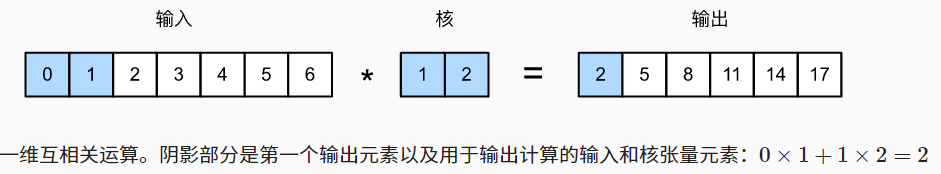

# TextCNN

[toc]

## 1.理论

### 1.1 基础概念

在文本处理中使用卷积神经网络:将文本序列当作一维图像

**一维卷积** -> 基于互相关运算的二维卷积的特例:

**多通道的一维卷积:**

**最大汇聚(池化)层:**

---

### 1.2 textCNN模型结构

textCNN模型设计如下所示：

1) 定义多个一维卷积核，并分别对输入执行卷积运算。具有不同宽度的卷积核可以捕获**不同数目**的**相邻词元**之间的局部特征
2) 在所有输出通道上执行最大时间汇聚层(MaxPool)，然后将所有标量汇聚输出连结为向量
3) 使用全连接层将连结后的向量转换为输出类别。可以用torch.nn.Dropout(0.5)来减少过拟合。

> `图15.3.5`通过一个具体的例子说明了textCNN的模型架构。输入是具有11个词元的句子，其中每个词元由6维向量表示(即单词的嵌入向量长度为6)。定义两个大小为(6,4)和(6,4)的一维卷积核(长必须为嵌入向量长度),这两个卷积核通道数分别为4和5,它们分别4个产生宽度为11-2+1=10的输出通道和5个宽度为11-4+1=8的输出通道。尽管这4+5=9个通道的宽度不同，但最大时间汇聚(池化)层在所有输出通道上执行MaxPool(相当于在一个通道上的所有词元中选择最大值),给出了一个宽度的4+5=9的一维向量，该向量最终通过全连接层被转换为用于二元情感预测的2维输出向量

---

> 1) 和图片不同,由于词元具有不可分割性,所以卷积核的长度必须是嵌入向量长度
> 2) 在文本处理中,卷积核的长度是嵌入向量维度(特征维度),而卷积核的宽度就是N-gram的窗口大小,代表了词元和上下文词之间的词距

## 2.实验

### 2.1 实验步骤

1) **数据预处理**,得到单词字典、样本数等基本数据
2) **构建CNN模型**,设置卷积核个数、输入输出通道数、宽度和输入嵌入向量的维度
3) **训练**
   1) **代入数据**,经过卷积和池化,再压平全连接,最后得到类别
   2) 把模型输出值和真实值相比,求得误差损失函数,运用Adam动量法梯度下降
4) **测试**

### 2.2 算法模型

