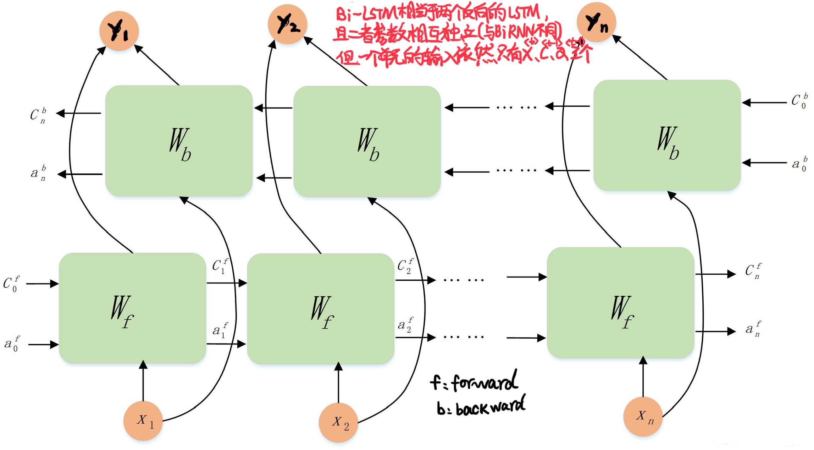

# Bi-LSTM

[toc]

## 1.理论

### 1.1 基本模型

Bi-LSTM模型分为2个**独立的LSTM**,输入序列分别以正序和逆序输入至2个LSTM模型进行特征提取,将2个输出向量进行拼接后形成的词向量作为该词的最终特征表达(因此底层维度是普通LSTM隐藏层维度的两倍)

### 1.2 Bi-LSTM的特点

Bi-LSTM的模型设计理念是使t时刻所获得特征数据**同时拥有过去和将来之间的信息**

- 实验证明,Bi-LSTM模型**对文本特征提取效率和性能要优于单个LSTM结构模型**
- Bi-LSTM中的**2个LSTM参数是相互独立**的,它们只共享训练集的word-embedding词向量列表等训练集基本信息。

## 2.实验

### 2.1 实验步骤

1) **数据预处理**,得到字典、样本数等基本数据
2) **构建Bi-LSTM模型**,设置输入模型的嵌入向量维度,隐藏层α向量和记忆细胞c的维度
3) **训练**
   1) **代入数据**,设置每个样本的时间步长度
   2) 得到模型输出值,取其中最大值的索引,找到字典中对应的字母,即为模型预测的下一个字母.
   3) 把模型输出值和真实值相比,求得误差损失函数,运用Adam动量法梯度下降
4) **测试**

### 2.2 实验模型

> 本实验句子长度70,训练长度70-1=69,即时间步长度n=69,使用了69个Bi-LSTM细胞单元

