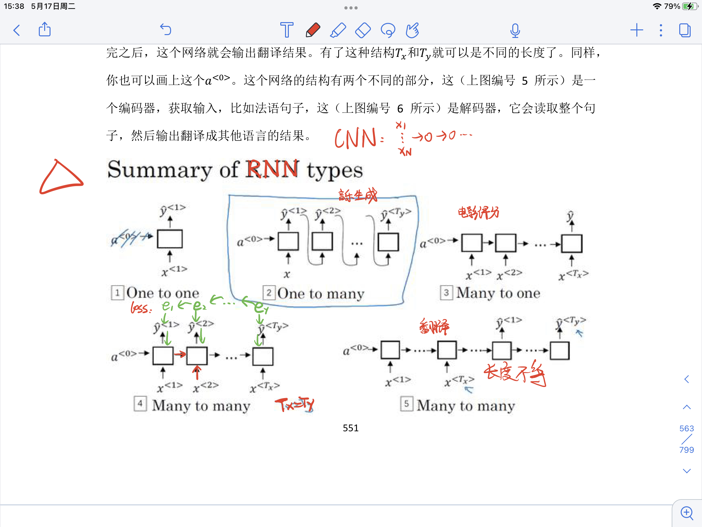

# TextRNN

## 1.基本概念

### 1.1 RNN和CNN的区别

并非刚性地记忆所有固定⻓度的序列，⽽是通过隐藏状态来存储之前时间步的信息

### 1.2 RNN的几种结构

**一对一,一对多,多对一,多对多(长度相等/不等)**

> 多个输入时,由a和x生成y和下一个a, 这一过程可以用nn.GRU和nn.LSTM模块表示,即可使用门控制单元或长短记忆模型,因此BiLSTM也可看作BiRNN+LSTM(编程时,双向和单向的不同就是在nn.LSTM()中添加一个bidirectional=True)

### 1.3 多对多的RNN

先输入零向量$a^{<0>}$,然后前向传播,先计算激活值$a^{<1>}$,然后计算$y^{<1>}$.

$a^{<1>}=g_1(W_{aa}a^{<0>}+W_{ax}x^{<1>}+b_a)$

$y^{<1>}=g_2(W_{ya}a^{<1>}+b_y)$

### 1.4 RNN的多对多结构

### 1.5 RNN的多对一结构

从`1.2 RNN的几种结构`可以看到多对一RNN和多对多RNN的不同之处,但是在训练中仍然把多对一RNN当作多对多RNN训练,只是不使用最后训练出的$y^{<1>}$~$y^{<t-1>}$

### 1.6 RNN的缺点

如果训练非常深的神经网络,对这个网络做从左到右的前向传播和而从右到左的后向传播,会发现输出$y^{<t>}$很难传播回去,很难影响前面的权重,这样的**梯度消失**问题使得RNN常常出现局部效应,不擅长处理长期依赖的问题
和梯度爆炸不同的是,梯度爆炸会使得参数爆炸,很容易就发现大量的NaN参数,因此可以很快地进行梯度修剪;但是梯度消失不仅难以察觉,而且很难改正

## 2.实验

### 2.1 实验步骤

1) **数据预处理**,得到单词字典、样本数等基本数据
2) **构建RNN模型**,设置输入模型的嵌入向量维度和隐藏层α向量的维度
3) **训练**
   1) **代入数据**,设置每个样本的时间步长度
   2) 得到模型输出值,取其中最大值的索引,找到字典中对应的单词,即为模型预测的下一个单词.
   3) 把模型输出值和真实值相比,求得误差损失函数,运用Adam动量法梯度下降
4) **预测**

### 2.2 算法模型

