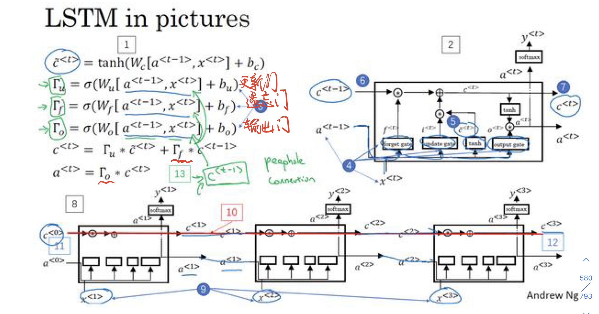

# LSTM

## 1.理论

### 1.1 LSTM与RNN

#### 1.1.1 RNN的缺点

如果训练非常深的神经网络,对这个网络做从左到右的前向传播和而从右到左的后向传播,会发现输出$y^{<t>}$很难传播回去,很难影响前面的权重,这样的**梯度消失**问题使得RNN常常出现局部效应,不擅长处理长期依赖的问题
和梯度爆炸不同的是,梯度爆炸会使得参数爆炸,很容易就发现大量的NaN参数,因此可以很快地进行梯度修剪;但是梯度消失不仅难以察觉,而且很难改正

#### 1.1.2 LSTM

LSTM(还有GRU)改变了RNN的隐藏层,使其可以更好地捕捉深层链接,改善梯度消失的问题

### 1.2 LSTM基本结构

## 2.实验

### 2.1 实验步骤

1) **数据预处理**,得到字典、样本数等基本数据
2) **构建LSTM模型**,设置输入模型的嵌入向量维度,隐藏层α向量和记忆细胞c的维度
3) **训练**
   1) **代入数据**,设置每个样本的时间步长度
   2) 得到模型输出值,取其中最大值的索引,找到字典中对应的字母,即为模型预测的下一个字母.
   3) 把模型输出值和真实值相比,求得误差损失函数,运用Adam动量法梯度下降
4) **预测**

### 2.2 算法模型

- 一个LSTM细胞单元有三个输入,分别是输入向量$x^{<t>}$、隐藏层向量$a^{<t-1>}$和记忆细胞$c^{<t-1>}$;
- 一个LSTM细胞单元有三个输出,分别是输出向量$y^{<t>}$、隐藏层向量$a^{<t>}$和记忆细胞$c^{<t>}$
- 本实验时间步长度n=3,即使用了三个LSTM细胞单元

