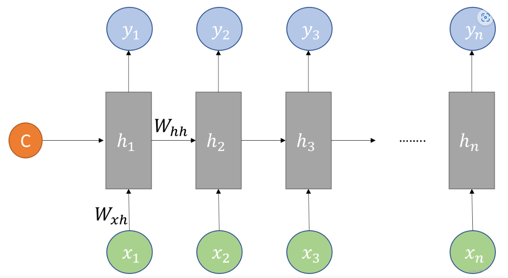

# Seq2Seq

## 1.理论

### 1.1 基本概念

#### 1.1.1 Seq2Seq的由来

在RNN模型需要解决的问题中，有一类`M to N`的问题，即输入输出不等长问题,例如机器翻译和生成概述。这种结构又叫做**Seq2Seq模型**，或者叫**Encoder-Decoder模型**。

#### 1.1.2 模型输出结果处理

在解码过程之后,由输出结果获得预测单词y的方法有以下几种：

1) **贪婪法(Greedy Search):** 根据字面意思,就是经过softmax之后取argmax,这种方式是最简单的，但也存在着问题：**局部最优不一定是全局最优**
2) **暴力搜索:** 这只是一种理论上的方法，但它的复杂度是$O(∣V∣^m)$,V是词库大小,显然是不可行的
3) **束搜索Beam Search:** 结合了Greedy Search和暴力搜索的特点,每次取概率最大的前k个,(k也叫做我们的Beam Size),这样选取的最后结果是一棵树，我们只需要选取路径得分最大的即可。但是这种算法的复杂度也是指数级别的。

### 1.2 模型结构

#### 1.2.1 Encoder

Encoder可以直接用一个RNN网络，它的主要任务是把输入数据编码并输出一个上下文向量$c$,可以直接用RNN的输出或最后一个隐状态向量$h_t$来得到$c$

#### 1.2.2 Decoder

Decoder也是一个RNN网络，它的主要任务是解码，把Encoder得到的上下文向量$c$作为其初始隐状态向量$h_0$,再根据输入$x$,得到输出结果

## 2.实验

### 2.1 实验步骤

1) **数据预处理**,得到字典、样本数等基本数据
2) **构建Seq2Seq模型**,分别设置编解码器的输入,
3) **训练**
   1) **代入数据**,输入编码器,然后输入解码器
   2) 得到模型输出值,取其中最大值的索引,找到字典中对应的字母,即为模型预测的下一个字母.
   3) 把模型输出值和真实值相比,求得误差损失函数,运用Adam动量法梯度下降
4) **预测**

### 2.2 算法模型

