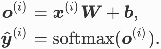
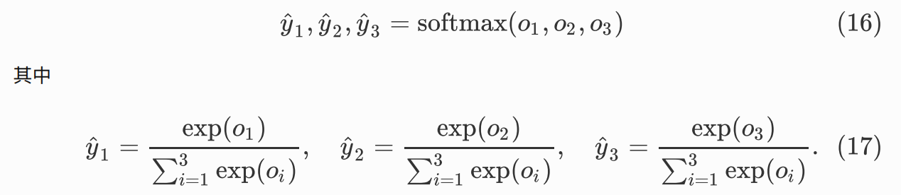
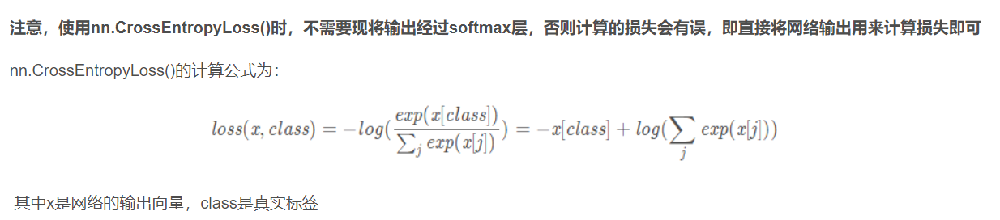

# DL基础

## 1.批量归一化

批量归一化只要是指对全连接层/卷积层做归⼀化

BatchNorm1d和BatchNorm2d都需要num_features参数值
`nn.BatchNorm1d(120) # 用于全连接层`
`nn.BatchNorm2d(6) # 用于卷积层`

在pytorch中可以直接把BatchNorm加入网络模块,案例代码如下:

```python
net = nn.Sequential(
    nn.Conv2d(1, 6, 5), # in_channels, out_channels,kernel_size
    nn.BatchNorm2d(6),
    nn.Sigmoid(),
    nn.MaxPool2d(2, 2), # kernel_size, stride
    nn.Conv2d(6, 16, 5),
    nn.BatchNorm2d(16),
    nn.Sigmoid(),
    nn.MaxPool2d(2, 2),
    d2l.FlattenLayer(),
    nn.Linear(16*4*4, 120),
    nn.BatchNorm1d(120),
    nn.Sigmoid(),
    nn.Linear(120, 84),
    nn.BatchNorm1d(84),
    nn.Sigmoid(),
    nn.Linear(84, 10)
    )
```

## 2.梯度

### 2.1 梯度计算

```python
x = torch.ones(2, 3, requires_grad=True)
print(x)
out1 = x.mean() # out1 = x.sum()
out1.requires_grad_(True)
out1.backward()
print(x.grad) # out对x求梯度:d(out)/dx

out2 = x.mean()
x.grad.data.zero_() # 梯度清0
out2.backward()
print(x.grad) # out对x求梯度
```

### 2.2 梯度清零

调用loss.backward()函数计算(向后传播,求导函数)之前都要将梯度清零，因为如果梯度不清零，pytorch中会将上次计算的梯度和本次计算的梯度累加。

```python
# param.grad.data.zero_()
loss = ~
optimizer = torch.optim.Adam(model.parameters(),lr=lr)
optimizer.zero_grad()
loss.backward()
```

### 2.3 梯度下降(优化)

optimizer优化器就是需要根据网络反向传播的梯度信息来更新网络的参数，以起到降低loss函数计算值的作用

固定搭配:

```python
# param.grad.data.zero_()
loss = ~
# torch.optim.SGD/Adagrad/RMSprop/Adadelta/Adam
optimizer = torch.optim.Adam(model.parameters(),lr=lr)
optimizer.zero_grad() 
loss.backward()
grad_clipping(model.parameters(), clipping_theta, device) # 梯度修剪
optimizer.step() # 更新所有的参数
```

## 3.Softmax

Softmax回归跟线性回归⼀样将输⼊特征与权重做线性叠加,与线性回归的⼀个主要不同在于,Softmax回归的输出值个数等于标签⾥的类别数.所一Softmax回归的输出层也是⼀个全连接层.
Softmax将输出值变换成**值为正且和为1**的概率分布.




`loss = nn.CrossEntropyLoss()`包含了Softmax运算和交叉熵损失计算


## 4.迁移学习

深度学习领域的迁移学习常常是指**预训练模型方法**(Pre-training + Fine-tuning).

### 4.1 采用预训练模型的原因

1.最主要原因:由于**没有足够的数据**训练整个网络,那么就把预训练模型的权重作为微调网络的权重,因为即使预训练权在当前微调过的新模型中不是最优解,也比从头训练好得多.
2.预训练模型是由大型数据集针对基础任务训练而成的,所以泛化性较好,对于对大多数下游任务都有一定用处,能够节省一些训练时间.

### 4.2 微调的三种形式

1.在已经训练好的基网络(n层)上添加自定义网络(m层) -> n层变为n+m层,训练时会遍历整个n+m层
2.冻结基网络(n层)，训练自定义网络(m层) -> 前面n层的权重不会再变化了,只训练后m层
3.解冻部分基网络，联合训练解冻层(0.5n层)和自定义网络(m层) -> 前面0.5n层的权重不会再变化了,只训练后0.5n+m层

> 第2种和第3种即数据不足,因此把预训练的权重当作新网络的全局最优权重(实际上只是局部最优)

### 4.3 模型权重文件生成

如果修改了模型,那么进行微调训练会生成新的权重文件,否则如果没有改变模型(例如BERT-微调.py),继续进行训练不会生成新的模型文件,只会改变原来的预训练模型文件内的内容(例如BERT-微调.py,只是加了一个输出层,模型并没有改变,所以只会修改原有权重文件的内容),但是模型权重改变,一定要保存到模型文件中,否则关闭程序后训练数据就丢失了.
> **1.以本科毕设举例:** 修改YOLOv5的模型结构,加上PSPNet模块,然后用yolov5s.pt作为预训练模型进行训练,由于修改了模型,所以会生成新的权重文件pspv5s.pt,由于微调模型的功能是建立在预训练模型基础上的,所以接下来的训练和最后在Predict.py和detect.py种进行检测也就都不再需要yolov5s.pt了.
> **2.以BERT-微调举例:** BERT-微调.py没有改变BERT模型本身,只是加了个输出层(微调训练只是改变输出层之前的网络),然后把数据集的输入(不同的数据集标签不同,训练后的效果也就不同)调整为BERT模式,所以直接修改原模型

### 4.4 打开和保存模型

**1.保存模型参数**
这种方法占用内存小,但使用时需要先创建一个空的模型实例

```python
net = cjk_model() # 先创建一个空的模型实例
net.load_state_dict(torch.load("./data/pre-training-parameter.pt")) # 只加载参数
################################################################
torch.save(net.state_dict(), "./data/fine-tuning-parameter.pt") # 只保存参数
```

**2.保存完整模型**
这种方法占用内存大,但是操作更加简单

```python
net = torch.load('./data/pre-training-model.pt') # 加载整个模型
################################################################
torch.save(net, './data/fine-tuning-model.pt') # 保存整个模型
```

BERT-微调.py通过json文件获取词汇数据,然后加载模型参数(虽然后缀为参数文件为"XXX.params",但和pt文件操作一样),因为没加载完整模型,所以加载和保存也只能用第一种方法

## 5.Other

### 5.1 矩阵拼接

```python
# X = torch.randn(1,2,2,2) # 4维随机数
X = torch.tensor([
[1,1,1],
[2,0,2],
[2,0,2]]) 
Y = torch.tensor([
[1,1,0],
[1,0,2],
[2,0,2]])
# matmul函数用于计算张量tensor相乘(即普通的矩阵相乘)
# a = torch.matmul(X,Y) 
# print(X)
# print(a)
# cat和stack,两种拼接,cat不增加维度,stack增加一维
# a = torch.cat((X,Y),dim=1) # dim:选择的方向,0是纵向拼接,1是横向拼接
a = torch.stack((X,Y),dim=2) # dim=0:2x3x3, 1:3x2x3, 2:3x3x2 
print(a)
```

### 5.2 全连接对比

corr2d_multi_in_out_1x1是对两个矩阵的每一个通道进行一维化,相当于:通道数*FlattenLayer(),同时也要两个矩阵各通道的矩阵乘法
conv3不是全连接,输出结果仍然是方阵而不是一维阵

```python
import torch
from torch import nn

# 1
# 多通道全连接 
def corr2d_multi_in_out_1x1(X, K):
    # 计算前需要对数据的形状进行调整(同时XK)
    # 做1x1卷积时，以上函数与之前实现的互相关运算函数corr2d_multi_in_out等价
    c_i, h, w = X.shape
    c_o = K.shape[0]
    X = X.view(c_i, h * w) # 计算前需要对数据的形状进行调整
    K = K.view(c_o, c_i) # 计算前需要对数据的形状进行调整
    Y = torch.mm(K, X) # 全连接层的矩阵乘法
    return Y.view(c_o, h, w) 

# 2
# 全连接层输出(一维化)
class FlattenLayer(nn.Module):
    def __init__(self):
       super(FlattenLayer, self).__init__()
    def forward(self, x): # x shape: (batch, *, *, ...)
       return x.view(x.shape[0], -1)
# 3     
# 卷积核为1的卷积:跨通道的特征整合,特征通道的升维和降维,减少卷积核参数（简化模型）
conv3 = nn.Conv2d(in_channels, out_channels,kernel_size=1, stride=stride) 
```

### 5.3 语法

`a=b<c`的意思是`a=(b<c)`

## 6.术语

**1.backbone:** 翻译为主干网络，大多时候指的是提取特征的网络，其作用就是提取图片中的信息，供后面的网络使用。
> 主干网络经常使用的是resnet VGG等基础网络，而不是我们自己设计的网络，因为这些网络已经证明了在分类等问题上的特征提取能力是很强的。在用这些网络作为backbone的时候，都是直接加载官方已经训练好的模型参数，后面接着我们自己的网络。让网络的这两个部分同时进行训练，因为加载的backbone模型已经具有提取特征的能力了，在我们的训练过程中，会对他进行微调，使得其更适合于我们自己的任务。

**2.head:** head是获取网络输出内容的网络，利用之前提取的特征，head利用这些特征，做出预测。

**3.neck:** 是放在backbone和head之间的，是为了更好的利用backbone提取的特征

**4.bottleneck:** 瓶颈的意思，通常指的是网络输入的数据维度和输出的维度不同，输出的维度比输入的小了许多
> 经常设置的参数bottle_num=256指的是网络输出的数据的维度是256,但输入进来的可能是1024维度的。

**5.GAP:** Global Average Pool全局平均池化，就是将某个通道的特征取平均值,在pytorch中，AdaptativeAvgpoold(1)代表自适应性全局平均池化

**6.Embedding:** 深度学习方法都是利用使用线性和非线性转换对复杂的数据进行自动特征抽取，并将特征表示为“向量”（vector），这一过程一般也称为“嵌入”（embedding）

**7.** 用于预训练的任务被称为**前置/代理任务(pretext task)**，用于微调的任务被称为**下游任务(downstream task)**
