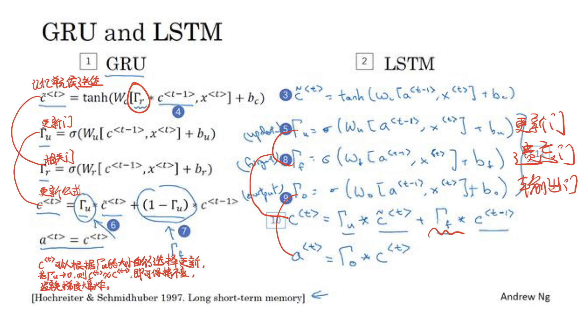

# 循环神经网络RNN

并非刚性地记忆所有固定⻓度的序列，⽽是通过隐藏状态来存储之前时间步的信息

## 1.基本概念

**RNN的几种结构:**一对一,一对多,多对一,多对多(长度相等/不等)

> 多个输入时,由a和x生成y和下一个a, 这一过程可以用nn.GRU和nn.LSTM模块表示,即可使用门控制单元或长短记忆模型,因此BiLSTM也可看作BiRNN+LSTM(编程时,双向和单向的不同就是在nn.LSTM()中添加一个bidirectional=True)

门控制单元**GRU**,长短记忆模型**LSTM:**
RNN深度太大时可能出现**梯度爆炸**问题->**梯度修剪:** 观察梯度向量,当它大于某个阈值,则进行缩放
深度太大时可能出现**梯度消失**问题->GRU/LSTM


双向循环神经网络**BRNN:**


深层循环神经网络**DRNN:**


## 2.RNN代码

代码主要繁琐在处理维度上

训练主要流程就是初始化模型的各个参数,定义一个rnn函数,用于某一层的rnn计算,然后迭代:每一次迭代都会进行随机/相邻采样,然后把采样出来的下一时间步的Y(相当于这一个时间步的结果)与X+state计算得到的output相减求误差,然后梯度求导等等.

预测主要流程就是传入模型参数,然后给一个初始的X,然后程序根据模型权重计算得到output,从中选出最大值作为结果,然后output的One-Hot向量又作为下一轮的输入......

```python
import numpy as np
import torch,time,math
from torch import nn, optim
import torch.nn.functional as F
import sys
sys.path.append("..")
import mymodule
device = torch.device('cuda' if torch.cuda.is_available() else 'cpu')

# 初始化化模型参数
def get_params():
    def _one(shape):
        # np.random.normal(均值,标准差,输出值的维度)从正态分布中抽取随机样本。
        ts = torch.tensor(np.random.normal(0, 0.01, size=shape),device=device, dtype=torch.float32)
        return torch.nn.Parameter(ts, requires_grad=True) #pytorch专用类型转换函数(生成参数属性,方便训练)
    # 隐藏层参数
    W_xh = _one((num_inputs, num_hiddens))
    # print(W_xh.shape)
    W_hh = _one((num_hiddens, num_hiddens))
    b_h = torch.nn.Parameter(torch.zeros(num_hiddens,device=device, requires_grad=True))
    # 输出层参数
    W_hq = _one((num_hiddens, num_outputs))
    b_q = torch.nn.Parameter(torch.zeros(num_outputs,device=device, requires_grad=True))
    return nn.ParameterList([W_xh, W_hh, b_h, W_hq, b_q])

# BATCH_SIZE:即一次训练所抓取的数据样本数量
def init_rnn_state(batch_size, num_hiddens, device):
    return (torch.zeros((batch_size, num_hiddens), device=device), )

# rnn函数定义了在⼀个时间步里如何计算隐藏状态和输出.这⾥的激活函数使用了tanh函数
# 根据前一个字符的onehot向量inputs,计算每一层的输入输出
def rnn(inputs, state, params):
    # inputs和outputs皆为num_steps个形状为(batch_size, vocab_size)的矩阵
    W_xh, W_hh, b_h, W_hq, b_q = params
    H, = state
    outputs = []
    for X in inputs:
        H = torch.tanh(torch.matmul(X, W_xh) + torch.matmul(H,W_hh) + b_h)
        Y = torch.matmul(H, W_hq) + b_q
        outputs.append(Y)
    return outputs,(H,)

# 加载歌词:
# char_to_idx是每一个字加上去重后的位置序号的字典
# idx_to_char是每一个字的列表
# vocab_size是总字数
# corpus_indices是一个列表,列表里的每个元素是与数据集中每个字符相对应的id(去重后的位置序号)
(corpus_indices, char_to_idx, idx_to_char, vocab_size) = mymodule.load_data_jay_lyrics()

# 隐藏单元个数num_hiddens是⼀个超参数
num_inputs, num_hiddens, num_outputs = vocab_size, 256, vocab_size

num_epochs, num_steps, batch_size, lr, clipping_theta = 250, 35, 32, 1e2, 1e-2

pred_period, pred_len, prefixes = 50, 50, ['分开', '不分开']
train_and_predict_rnn(rnn, get_params, init_rnn_state, num_hiddens,
                          vocab_size, device, corpus_indices, idx_to_char,
                          char_to_idx, True, num_epochs, num_steps,
                          lr, clipping_theta, batch_size, pred_period,
                          pred_len, prefixes)
```

## 3.GRU代码

代码主要繁琐在处理维度上

训练主要流程就是初始化模型的各个参数,定义一个rnn函数,用于某一层的rnn计算,然后迭代:每一次迭代都会进行随机/相邻采样,然后把采样出来的下一时间步的Y(相当于这一个时间步的结果)与X+state计算得到的output相减求误差,然后梯度求导等等.

预测主要流程就是传入模型参数,然后给一个初始的X,然后程序根据模型权重计算得到output,从中选出最大值作为结果,然后output的One-Hot向量又作为下一轮的输入......

```python

# 读取数据
import numpy as np
import torch
from torch import nn, optim
import torch.nn.functional as F
import sys
sys.path.append("..")
import mymodule
from mymodule import *
device = torch.device('cuda' if torch.cuda.is_available() else 'cpu')

# 加载歌词
(corpus_indices, char_to_idx, idx_to_char, vocab_size) = mymodule.load_data_jay_lyrics()

num_inputs, num_hiddens, num_outputs = vocab_size, 256, vocab_size
print('will use', device)
def get_params():
    def _one(shape):
        ts = torch.tensor(np.random.normal(0, 0.01, size=shape),device=device, dtype=torch.float32)
        return torch.nn.Parameter(ts, requires_grad=True)
    def _three():
        return (_one((num_inputs, num_hiddens)),_one((num_hiddens, num_hiddens)),torch.nn.Parameter(torch.zeros(num_hiddens,device=device, dtype=torch.float32), requires_grad=True))

    W_xz, W_hz, b_z = _three() # 更新门参数
    W_xr, W_hr, b_r = _three() # 重置门参数
    W_xh, W_hh, b_h = _three() # 候选隐藏状态参数

    # 输出层参数
    W_hq = _one((num_hiddens, num_outputs))
    b_q = torch.nn.Parameter(torch.zeros(num_outputs,device=device, dtype=torch.float32), requires_grad=True)

    return nn.ParameterList([W_xz, W_hz, b_z, W_xr, W_hr, b_r,W_xh, W_hh, b_h, W_hq, b_q])

def init_gru_state(batch_size, num_hiddens, device):
    return (torch.zeros((batch_size, num_hiddens), device=device), )

def gru(inputs, state, params):
    W_xz, W_hz, b_z, W_xr, W_hr, b_r, W_xh, W_hh, b_h, W_hq, b_q = params
    H, = state
    outputs = []
    for X in inputs:
        Z = torch.sigmoid(torch.matmul(X, W_xz) + torch.matmul(H,W_hz) + b_z)
        R = torch.sigmoid(torch.matmul(X, W_xr) + torch.matmul(H,W_hr) + b_r)
        H_tilda = torch.tanh(torch.matmul(X, W_xh) + R * torch.matmul(H, W_hh) + b_h)
        H = Z * H + (1 - Z) * H_tilda
        Y = torch.matmul(H, W_hq) + b_q
        outputs.append(Y)
    return outputs, (H,)

num_epochs, num_steps, batch_size, lr, clipping_theta = 160, 35, 32, 1e2, 1e-2

pred_period, pred_len, prefixes = 40, 50, ['分开', '不分开']

train_and_predict_rnn(gru, get_params, init_gru_state, num_hiddens,
                          vocab_size, device, corpus_indices, idx_to_char,
                          char_to_idx, True, num_epochs, num_steps,
                          lr, clipping_theta, batch_size, pred_period,
                          pred_len, prefixes)
```

## 4.LSTM代码

与GRU基本一致

```python
import numpy as np
import torch
from torch import nn, optim
import torch.nn.functional as F
import sys,mymodule
from mymodule import *
sys.path.append("..")
device = torch.device('cuda' if torch.cuda.is_available() else 'cpu')
(corpus_indices, char_to_idx, idx_to_char, vocab_size) =load_data_jay_lyrics()
num_inputs, num_hiddens, num_outputs = vocab_size, 256, vocab_size
print('will use', device)

def get_params():
    def _one(shape):
        ts = torch.tensor(np.random.normal(0, 0.01, size=shape),device=device, dtype=torch.float32)
        return torch.nn.Parameter(ts, requires_grad=True)
    def _three():
        return (_one((num_inputs, num_hiddens)),_one((num_hiddens, num_hiddens)),
                torch.nn.Parameter(torch.zeros(num_hiddens,device=device, dtype=torch.float32), requires_grad=True))

    W_xi, W_hi, b_i = _three()  # 输⼊⻔参数
    W_xf, W_hf, b_f = _three()  # 遗忘⻔参数
    W_xo, W_ho, b_o = _three()  # 输出⻔参数
    W_xc, W_hc, b_c = _three()  # 候选记忆细胞参数
    # 输出层参数
    W_hq = _one((num_hiddens, num_outputs))
    b_q = torch.nn.Parameter(torch.zeros(num_outputs,device=device, dtype=torch.float32), requires_grad=True)
    return nn.ParameterList([W_xi, W_hi, b_i, W_xf, W_hf, b_f, W_xo, W_ho, b_o, W_xc, W_hc, b_c, W_hq, b_q])

def init_lstm_state(batch_size, num_hiddens, device):
    return (torch.zeros((batch_size, num_hiddens), device=device),
            torch.zeros((batch_size, num_hiddens), device=device))

def lstm(inputs, state, params):
    [W_xi, W_hi, b_i, W_xf, W_hf, b_f, W_xo, W_ho, b_o, W_xc, W_hc, b_c, W_hq, b_q] = params
    (H, C) = state
    outputs = []
    for X in inputs:
        I = torch.sigmoid(torch.matmul(X, W_xi) + torch.matmul(H, W_hi) + b_i)
        F = torch.sigmoid(torch.matmul(X, W_xf) + torch.matmul(H, W_hf) + b_f)
        O = torch.sigmoid(torch.matmul(X, W_xo) + torch.matmul(H, W_ho) + b_o)
        C_tilda = torch.tanh(torch.matmul(X, W_xc) + torch.matmul(H, W_hc) + b_c)
        C = F * C + I * C_tilda
        H = O * C.tanh()
        Y = torch.matmul(H, W_hq) + b_q
        outputs.append(Y)
    return outputs, (H, C)


num_epochs, num_steps, batch_size, lr, clipping_theta = 160, 35, 32, 1e2, 1e-2

pred_period, pred_len, prefixes = 40, 50, ['分开', '不分开']

train_and_predict_rnn(lstm, get_params, init_lstm_state, num_hiddens,
                      vocab_size, device, corpus_indices, idx_to_char,
                      char_to_idx, True, num_epochs, num_steps,
                      lr, clipping_theta, batch_size, pred_period,
                      pred_len, prefixes)

```

## 5.RNN-GRU-LSTM(pytorch简洁版)代码

基本流程和普通版一致,只是把一些函数(比如梯度下降sgd)换成了pytorch自带的,计算每一层输出的普通版的rnn函数换成了RNNModel(相当于做了兼容处理的nn.RNN),移植性更好

```python
import numpy as np
import torch,time,math
from torch import nn, optim
import torch.nn.functional as F
import sys
sys.path.append("..")
from mymodule import *
import mymodule
device = torch.device('cuda' if torch.cuda.is_available() else 'cpu')

class RNNModel(nn.Module):
    def __init__(self, rnn_layer, vocab_size):
        super(RNNModel, self).__init__()
        self.rnn = rnn_layer
        self.hidden_size = rnn_layer.hidden_size * (2 if rnn_layer.bidirectional else 1) 
        self.vocab_size = vocab_size
        self.dense = nn.Linear(self.hidden_size, vocab_size)
        self.state = None

    def forward(self, inputs, state): # inputs: (batch, seq_len)
        # 获取one-hot向量表示
        X = to_onehot(inputs, self.vocab_size) # X是个list
        Y, self.state = self.rnn(torch.stack(X), state)
        # 全连接层会首先将Y的形状变成(num_steps * batch_size, num_hiddens)，它的输出
        # 形状为(num_steps * batch_size, vocab_size)
        output = self.dense(Y.view(-1, Y.shape[-1]))
        return output, self.state

def predict_rnn_pytorch(prefix, num_chars, model, vocab_size, device, idx_to_char,
                      char_to_idx):
    state = None
    output = [char_to_idx[prefix[0]]] # output会记录prefix加上输出
    for t in range(num_chars + len(prefix) - 1):
        X = torch.tensor([output[-1]], device=device).view(1, 1)
        if state is not None:
            if isinstance(state, tuple): # LSTM, state:(h, c)  
                state = (state[0].to(device), state[1].to(device))
            else:   
                state = state.to(device)
            
        (Y, state) = model(X, state)  # 前向计算不需要传入模型参数
        if t < len(prefix) - 1:
            output.append(char_to_idx[prefix[t + 1]])
        else:
            output.append(int(Y.argmax(dim=1).item()))
    return ''.join([idx_to_char[i] for i in output])

def train_and_predict_rnn_pytorch(model, num_hiddens, vocab_size, device,
                                corpus_indices, idx_to_char, char_to_idx,
                                num_epochs, num_steps, lr, clipping_theta,
                                batch_size, pred_period, pred_len, prefixes):
    loss = nn.CrossEntropyLoss()
    optimizer = torch.optim.Adam(model.parameters(), lr=lr)
    model.to(device)
    state = None
    for epoch in range(num_epochs):
        l_sum, n, start = 0.0, 0, time.time()
        data_iter = mymodule.data_iter_consecutive(corpus_indices, batch_size, num_steps, device) # 相邻采样
        for X, Y in data_iter:
            if state is not None:
                # 使用detach函数从计算图分离隐藏状态, 这是为了
                # 使模型参数的梯度计算只依赖一次迭代读取的小批量序列(防止梯度计算开销太大)
                if isinstance (state, tuple): # LSTM, state:(h, c)  
                    state = (state[0].detach(), state[1].detach())
                else:   
                    state = state.detach()

            (output, state) = model(X, state) # output: 形状为(num_steps * batch_size, vocab_size)
            
            # Y的形状是(batch_size, num_steps)，转置后再变成长度为
            # batch * num_steps 的向量，这样跟输出的行一一对应
            y = torch.transpose(Y, 0, 1).contiguous().view(-1)
            l = loss(output, y.long()) #Y是采样出来的下一步的真实结果
            # 梯度清0:调用backward()函数之前都要将梯度清零，因为如果梯度不清零，pytorch中会将上次计算的梯度和本次计算的梯度累加。
            optimizer.zero_grad()
            l.backward() #向后传播,自动求导
            # 梯度裁剪
            grad_clipping(model.parameters(), clipping_theta, device)
            optimizer.step()
            l_sum += l.item() * y.shape[0]
            n += y.shape[0]
        
        try:
            perplexity = math.exp(l_sum / n)
        except OverflowError:
            perplexity = float('inf')
        
        #预测
        if (epoch + 1) % pred_period == 0:
            print('epoch %d, perplexity %f, time %.2f sec' % (
                epoch + 1, perplexity, time.time() - start))
            for prefix in prefixes:
                print(' -', predict_rnn_pytorch(
                    prefix, pred_len, model, vocab_size, device, idx_to_char,
                    char_to_idx))

(corpus_indices, char_to_idx, idx_to_char, vocab_size) = mymodule.load_data_jay_lyrics()

num_epochs, num_steps, batch_size, lr, clipping_theta = 250, 35, 32, 1e2, 1e-2

pred_period, pred_len, prefixes = 50, 50, ['分开', '不分开']
# 隐藏单元个数num_hiddens是⼀个超参数
num_inputs, num_hiddens, num_outputs = vocab_size, 256, vocab_size
num_epochs, batch_size, lr, clipping_theta = 250, 32, 1e-3, 1e-2

# 计算每一层输出的普通版的rnn函数换成了nn自带的nn.RNN
# RNNModel和rnn_layer(nn.RNN)是同一效果,区别在于RNNModel做了一些兼容处理
rnn_layer = nn.RNN(input_size=vocab_size, hidden_size=num_hiddens) # 换成nn.GRU/LSTM(~)即可实现GRU/LSTM模型
model = RNNModel(rnn_layer, vocab_size).to(device)
train_and_predict_rnn_pytorch(model, num_hiddens, vocab_size,
            device,corpus_indices, idx_to_char,char_to_idx,num_epochs, 
            num_steps, lr,clipping_theta,batch_size, pred_period, pred_len,prefixes)
```
