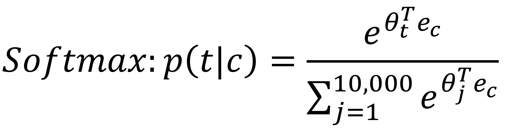
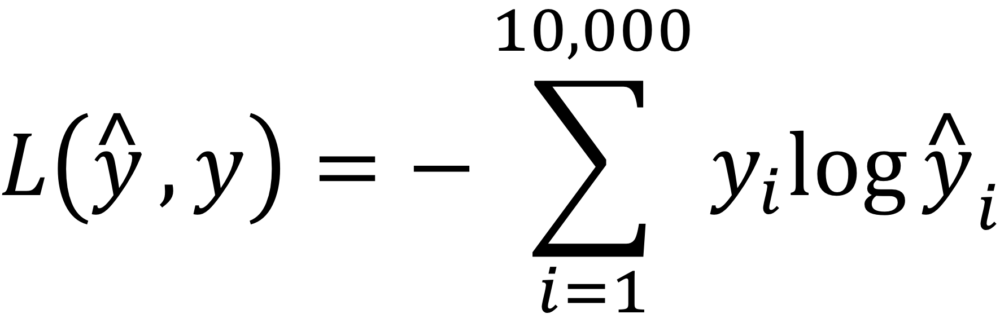
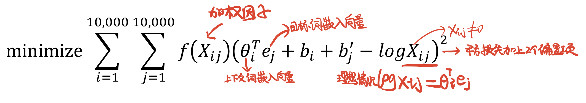

# 词嵌入

## 1.特征化

One-Hot向量维度太大,而且各个词之间是相互独立的(各One-Hot向量内积均为0),所以考虑加入特征化方法,嵌入矩阵的特征数也可称作词向量的维度

> **1.** 图中所示表格可以视作一个矩阵,每一列都是一个词的矩阵向量,可以通过计算余弦相似度或欧氏距离来判定各个单词的相似程度 -> 近义词 ; **t-SNE算法**就是这种思想,通过把高维(一个特征就有1维)的数据映射到2维空间,相似的单词则会出现聚集现象
**2.** 也可以利用矩阵值来进行类比推理:例如Man-Woman≈King-Queen,则当可以初步认为(Man,King)和(Woman,Queen)是对应的,则当计算man对于woman,那么king相对于什么时,就要找到使Similarity(king-man+woman)最大的单词 ->类比词 .

## 2.嵌入矩阵

特征化所示整个图表即为**嵌入矩阵**,矩阵的一列即为**嵌入向量**,在计算上我们可以通过`嵌入矩阵E*One-Hot向量`求得一个单词的嵌入向量

## 3.Word2Vec算法

Word2Vec算法分为Skip-Gram模型(跳字模型)和连续词袋模型(continuous bag of words,CBOW)

### 3.1 Skip-Gram模型(跳字模型)

Skip-Gram模型(跳字模型):随机选一个词作为上下文词,然后在一定词距之内随机选择目标词,可以得到两个词的嵌入向量,然后即可计算概率P=Softmax(θ'*e):

> 其中θ和e分别是上下文词的嵌入向量和目标词的嵌入向量,10000是词汇表大小.

相应地,我们也可以求得损失函数:

> 其中y是目标词的One-Hot向量,而$\hat{y}$是Softmax输出的10000维的One-Hot向量

### 3.2 近似训练方法

由于词汇表常常很大,逐个求和计算概率太慢,所以有一些减少计算量的方法,主要分为层序Softmax和负采样两种.
**1.层序Softmax**是指并不马上确定单词所属类别,而是由第一个分类器先确定目标词再词汇表的前1/2还是后1/2,然后第二个分类器再确定是在前1/4还是第二组1/4 ......构建分类树,每个目标词都是一个叶子节点,每个节点都是一个二分类器,所以对于新目标词不需要再次对整个嵌入向量元素进行计算 (由于词频不均匀,分类树并不对称)
**2.负采样**是指学习时先选择一个正确目标词(标为1),再选择K个错误目标词(标为0)进行训练,特意采集错误样本即为负采样,一个单词被负采样的概率通常设置为(词频/所有单词词频之和)^0.75

### 3.3 项目实践

>项目目的:训练出嵌入矩阵(我们设词汇表大小为训练样本单词总数,词向量维度/嵌入矩阵特征数为100)
主要步骤:
**1.数据预处理:** 整理训练文本,提取中心词和背景词,通过负采样加入噪声词(用label=0标识)
**2.定义数据类:**  整合三种单词,进行填充(用掩码=0标识)
**3.skip_gram(跳字模型)** 前向概率运算(中心词嵌入向量和上下文+噪声词的嵌入向量之积)
**4.训练:** 定义二元交叉熵损失函数,梯度下降等信息,**训练出嵌入矩阵**(我们设词汇表大小为训练样本单词总数,词向量维度/嵌入矩阵特征数为100)
**3.测试:** 输入任意单词,即可返回相应的余弦相似度最高的其它单词

```python
# Word2Vec
import collections
import math
import random
import sys
import time
import os
import numpy as np
import torch
from torch import nn
import torch.utils.data as Data


with open('./ptb/ptb.train.txt', 'r') as f:
    lines = f.readlines()
    # 把句子分成词
    raw_dataset = [st.split() for st in lines]# st是sentence的缩写
# print(raw_dataset)
# print("# Sentences' length is %d." % len(raw_dataset)) # Sentences' length is 42068.

# 对于数据集的前3个句子，打印每个句子的词数和前5个词。
# 这个数据集中句尾符为"<eos>"，生僻词全用"<unk>"表示，数字则被替换成了"N"。
for st in raw_dataset[:3]:
    pass # print('# words:', len(st), st[:5])

# 建立词语索引
# 统计所有单词的词频(单词从词频高到词频低排序)
counter = collections.Counter([wd for st in raw_dataset for wd in st]) # wd是word的缩写
# 为了计算简单,只保留在数据集中至少出现5次的词
counter = dict(filter(lambda x: x[1] >= 5, counter.items()))
# print(couter)
# 然后将词映射到整数索引,#只保留单词
idx_to_word = [wd for wd, _ in counter.items()] 
# print(idx_to_word)
# print(len(idx_to_word)) # 9858
# 为每个单词增加位置序号
word_to_idx = {wd: idx for idx, wd in enumerate(idx_to_word)}
# print(word_to_idx)
# print(len(word_to_idx)) # 数据集单词数9858(去重)
dataset = [[word_to_idx[wd] for wd in st if wd in word_to_idx]
           for st in raw_dataset] # 每个句子的每个单词如果词频＞5,则输出其位置序号
# print(dataset)
# print(len(dataset) # 42068个句子
num_words = sum([len(st) for st in dataset]) # 数据集单词数(不去重):887100
# print('# 数据集单词数(不去重): %d' % num_words) # 输出 '# words: 887100'

# 二次采样(高频词又更大概率被抛弃)
def discard(idx):
    # print(idx_to_word)
    # print(idx_to_word[idx])
    # print(counter[idx_to_word[idx]])
    # print(counter[idx_to_word[idx]] * num_words)
    return random.uniform(0, 1) < 1 - math.sqrt( # 减法符号-的优先级高于小于符号<
        1e-4 / counter[idx_to_word[idx]] * num_words) # 
subsampled_dataset = [[idx for idx in st if not discard(idx)] for st in dataset]
# print('# words: %d' % sum([len(st) for st in subsampled_dataset])) # '# words: 375875'

# 提取中心词和背景词
def get_centers_and_contexts(dataset, max_word_distance):
    centers, contexts = [], []
    for st in dataset:
        if len(st) < 2:  # 每个句子至少要有2个词才可能组成一对"中心词-背景词"
            continue
        centers += st
        for center_i in range(len(st)):
            word_distance = random.randint(1, max_word_distance)
            indices = list(range(max(0, center_i - word_distance),
                                 min(len(st), center_i + 1 + word_distance)))
            indices.remove(center_i)  # 将中心词排除在背景词之外
            contexts.append([st[idx] for idx in indices])
    return centers, contexts
# 下面我们创建一个人工数据集,其中含有词数分别为7和3的两个句子.设最大词距为2,打印所有中心词和它们的背景词.
tiny_dataset = [list(range(7)), list(range(7, 10))] # [[0, 1, 2, 3, 4, 5, 6], [7, 8, 9]]
# print('dataset', tiny_dataset)
for center, context in zip(*get_centers_and_contexts(tiny_dataset, 2)):
    pass # print('center', center, 'has contexts', context)
# 实验中,我们设最大背景窗口大小为5.
all_centers, all_contexts = get_centers_and_contexts(subsampled_dataset, 5) # 提取数据集中所有的中心词及其背景词。
# print(len(all_contexts)) # 375073

# 使用负采样来进行近似训练。对于一对中心词和背景词，我们随机采样个噪声词.
# 根据word2vec论文的建议，噪声词采样概率设为词频与总词频之比的0.75次方.
# 负采样: 为每个上下文单词选出K个噪音单词
def get_negatives(all_contexts, sampling_weights, K):
    all_negatives, neg_candidates, i = [], [], 0
    population = list(range(len(sampling_weights)))# 1~9858
    for contexts in all_contexts: # 对于每个单词的上下文单词
        negatives = []
        while len(negatives) < K*len(contexts): # 每个上下文单词的负采样个数为5
            if i == len(neg_candidates):
                i = 0
                # 根据每个词的权重（sampling_weights）随机生成k个词的索引作为噪声词。
                # random.choices重复1e5次,每次按照概率从population中取出元素
                neg_candidates = random.choices(population, sampling_weights, k=int(1e5))
            # 每次选择1个加入,总共K*len(contexts)个
            neg = neg_candidates[i]
            i = i + 1
            # 噪声词不能是背景词
            if neg not in set(contexts):
                negatives.append(neg)
        all_negatives.append(negatives)
    return all_negatives

# 一个单词被负采样的概率通常设置为(词频/所有单词词频之和)^0.75
sampling_weights = [counter[w]**0.75 for w in idx_to_word] # 此处不必除以sum(random.choice自动除)
# print(len(sampling_weights)) # 9858
all_negatives = get_negatives(all_contexts, sampling_weights, 5)
# print(all_negatives)
# print(len(all_negatives)) # 374130

# 从数据集中提取所有中心词all_centers,
# 以及每个中心词对应的背景词all_contexts和噪声词all_negatives.我们先定义一个Dataset类.
class MyDataset(torch.utils.data.Dataset):
    def __init__(self, centers, contexts, negatives):
        assert len(centers) == len(contexts) == len(negatives) # ????
        self.centers = centers
        self.contexts = contexts
        self.negatives = negatives
        
    def __getitem__(self, index):
        return (self.centers[index], self.contexts[index], self.negatives[index])

    def __len__(self):
        return len(self.centers)
        
# 我们将通过随机小批量来读取它们.
# 在一个小批量数据中,每个样本包括一个中心词以及它所对应的背景词和噪声词
def batchify(data): # data是一个长度为批量大小的列表
    """
    用作DataLoader的参数collate_fn: 输入是个长为batchsize的list, 
    list中的每个元素都是Dataset类调用__getitem__得到的结果
    """
    max_len = max(len(c)+len(n) for _, c, n in data) # max(len(context)+len(negative))
    centers, contexts_negatives, masks, labels = [], [], [], []
    for center, context, negative in data:
        cur_len = len(context) + len(negative)
        centers += [center]
        # 将每个样本的背景词和噪声词连结在一起,并添加填充项0直至连结后的长度均为(max_len变量)
        contexts_negatives += [context + negative + [0]*(max_len-cur_len)]
        masks += [[1]*cur_len + [0]*(max_len-cur_len)] # masks中每一个元素分别与连结后的背景词和噪声词contexts_negatives中的元素一一对应
        labels += [[1]*len(context) + [0]*(max_len-len(context))] # 将contexts_negatives变量中的背景词和噪声词区分开来
    return (torch.tensor(centers).view(-1, 1), torch.tensor(contexts_negatives),
            torch.tensor(masks), torch.tensor(labels))

batch_size = 512
num_workers = 0 if sys.platform.startswith('win32') else 4

dataset = MyDataset(all_centers, all_contexts, all_negatives)
data_iter = Data.DataLoader(dataset, batch_size, shuffle=True, collate_fn=batchify, num_workers=num_workers)
for batch in data_iter:
    for name, data in zip(['centers', 'contexts_negatives', 'masks', 'labels'], batch):
        print(name, 'shape:', data.shape)
    break

'''
# Skip-Gram模型(跳字模型):随机选一个词作为上下文词,然后在一定词距之内随机选择目标词,
# 可以得到两个词的嵌入向量,然后即可计算概率P=Softmax(θ'*e).
'''
# 获取词嵌入的层称为嵌入层,在PyTorch中可以通过创建nn.Embedding实例得到.
# 嵌入层的权重是一个矩阵(即嵌入矩阵),其行数为词典大小(num_embeddings),列数为每个词向量的维度(embedding_dim),即特征数.
# 我们设词典大小为20,词向量的维度为4。
embed = nn.Embedding(num_embeddings=20, embedding_dim=4) #创建嵌入层对象
# print(embed)
# print(embed.weight) # 输出嵌入矩阵

# 嵌入层的输入为词的索引.输入一个词的索引i,嵌入层返回权重矩阵的第i行作为它的词向量
# 下面我们将形状为2行3列的索引输入进嵌入层,由于词向量的维度为4,我们得到形状为(2, 3, 4)的词向量
x = torch.tensor([[1, 2, 3], [4, 5, 6]], dtype=torch.long) # x的每个元素值都是一个索引
# print(embed(x))
X = torch.ones((2, 1, 4)) # 2个1x4的矩阵
Y = torch.ones((2, 4, 6)) # 2个4x6的矩阵
# print(torch.bmm(X, Y)) # 乘法运算:XY第一维必须相等且不参加运算, X的第3维*Y的第2维 -> (2,1,6)

def skip_gram(center, contexts_and_negatives, embed_v, embed_u): # 跳字模型前向计算概率
    v = embed_v(center)
    u = embed_u(contexts_and_negatives)
    pred = torch.bmm(v, u.permute(0, 2, 1)) # u.permute(0, 2, 1)把1维和2维交换,可以看作转置
    # pred= θ'*e
    return pred

# 二元交叉熵损失函数
class SigmoidBinaryCrossEntropyLoss(nn.Module):
    def __init__(self): # none mean sum
        super(SigmoidBinaryCrossEntropyLoss, self).__init__()
    def forward(self, inputs, targets, mask=None):
        """
        input – Tensor shape: (batch_size, len)
        target – Tensor of the same shape as input
        """
        inputs, targets, mask = inputs.float(), targets.float(), mask.float()
        res = nn.functional.binary_cross_entropy_with_logits(inputs, targets, reduction="none", weight=mask)
        return res.mean(dim=1)

loss = SigmoidBinaryCrossEntropyLoss()
pred = torch.tensor([[1.5, 0.3, -1, 2], [1.1, -0.6, 2.2, 0.4]])
# 标签变量label中的1和0分别代表背景词和噪声词
label = torch.tensor([[1, 0, 0, 0], [1, 1, 0, 0]])
# 可以通过掩码变量指定小批量中参与损失函数计算的部分预测值和标签,即区分非填充和填充,然后只令非填充参与损失函数的计算
# 当掩码为1时,相应位置的预测值和标签将参与损失函数的计算;
# 当掩码为0时,相应位置的预测值和标签则不参与损失函数的计算.
# 掩码变量可用于避免填充项对损失函数计算的影响.
mask = torch.tensor([[1, 1, 1, 1], [1, 1, 1, 0]])  # 掩码变量
print(loss(pred, label, mask) * mask.shape[1] / mask.float().sum(dim=1)) # 损失值

embed_size = 100 #嵌入矩阵特征数/词向量维度
net = nn.Sequential(
    nn.Embedding(num_embeddings=len(idx_to_word), embedding_dim=embed_size),
    nn.Embedding(num_embeddings=len(idx_to_word), embedding_dim=embed_size)
)

def train(net, lr, num_epochs):
    device = torch.device('cuda' if torch.cuda.is_available() else 'cpu')
    print("train on", device)
    net = net.to(device)
    optimizer = torch.optim.Adam(net.parameters(), lr=lr)
    for epoch in range(num_epochs):
        start, l_sum, n = time.time(), 0.0, 0
        for batch in data_iter:
            center, context_negative, mask, label = [d.to(device) for d in batch]
            pred = skip_gram(center, context_negative, net[0], net[1])
            
            # 使用掩码变量mask来避免填充项对损失函数计算的影响
            l = (loss(pred.view(label.shape), label, mask) *
                 mask.shape[1] / mask.float().sum(dim=1)).mean() # 一个batch的平均loss
            optimizer.zero_grad()
            l.backward()
            optimizer.step()
            l_sum += l.cpu().item()
            n += 1
        print('epoch %d, loss %.2f, time %.2fs' % (epoch + 1, l_sum / n, time.time() - start))

train(net, 0.01, 10)

def get_similar_words(query_word, k, embed):
    W = embed.weight.data # embed.weight即为嵌入矩阵
    x = W[word_to_idx[query_word]] # x是输入单词的嵌入向量(word_to_idx是每个单词增加位置序号的字典)
    # 求所有单词和query_word的余弦相似度(添加的1e-9是为了数值稳定性)
    cos = torch.matmul(W, x) / (torch.sum(W*W, dim=1) * torch.sum(x*x) + 1e-9).sqrt()
    _, topk = torch.topk(cos, k=k+1) # torch.topk输出降序后的前k个大小的元素值及索引
    topk = topk.cpu().numpy()
    for i in topk[1:]:  # 除去输入词
        print('cosine sim=%.3f: %s' % (cos[i], (idx_to_word[i])))
        
get_similar_words('chip', 3, net[0])
                                     
```

## 4.子词嵌入(FastText)

Word2Vec中，我们并没有直接利用构词学中的信息,直接把不同形态的单词当作毫无关系的两个单词处理,鉴于此，FastText提出了子词嵌入(Subword Embedding)的方法，从而试图将构词信息引入Word2Vec中的跳字模型.

在FastText中，每个中心词被表示成子词的集合。下面我们用单词"where"作为例子来了解子词是如何产生的。首先，我们在单词的首尾分别添加特殊字符"&lt;"和"&gt;"以区分作为前后缀的子词.然后，将单词当成一个由字符构成的序列来提取n元语法。例如,当n=3时,实际单词为"&lt;where&gt;",我们得到所有长度为3的子词："&lt;wh"、"whe"、"her"、"ere"、"&lt;re&gt;"以及特殊子词"&lt;where&gt;".

在fastText中,词典是所有词的子词集合的并集.假设词典中子词$g$的向量为$\boldsymbol{z}_g$，那么跳字模型中词$w$的作为中心词的向量$\boldsymbol{v}_w$则表示成

$$
\boldsymbol{v}_w = \sum_{g\in\mathcal{G}_w} \boldsymbol{z}_g.
$$

>fastText的其余部分同跳字模型一致,不在此重复.可以看到，与跳字模型相比，fastText中词典规模更大，造成模型参数更多，同时一个词的向量需要对所有子词向量求和，继而导致计算复杂度更高。但与此同时，较生僻的复杂单词，甚至是词典中没有的单词，可能会从同它结构类似的其他词那里获取更好的词向量表示。
>fastText在word2vec中的跳字模型的基础上,将中心词向量表示成单词的子词向量之和。这种子词嵌入利用构词上的规律,通常可以提升生僻词表示的质量。

## 5.GloVe词向量

GloVe统计单词i在一定词距范围中的不同单词j出现的频数Xij,形成一个n*n的频数矩阵,GloVe模型所做工作非常简单,就是通过梯度下降来优化:

> 其中10000是词汇表大小,f(x)是加权因子,取值选择为当频数x小于阈值时,取$f(x)=(x/c)^α$,达到阈值则f(x)=1,(因为f(0)=0,所以当两个词没有同时出现时Xij=0,这时就设0log0=0).
这样既能保证the,a,an等高频词汇权重提高但不会太高,也不会让部分低频词汇的权重太低.

## 6.近义词和类比词(预训练模型)

```python
# 近义词和类比词(预训练模型)
# 使用预训练模型->在大规模语料上预训练的词向量常常可以应用于下游自然语言处理任务中
import torch
import torchtext.vocab as vocab

vocab.pretrained_aliases.keys() # 查看glove词嵌入提供的预训练模型
cache_dir = "./glove"
# 下载模型
# glove = vocab.pretrained_aliases["glove.6B.50d"](cache=cache_dir) # 预训练模型命名规范为模型.（数据集.）数据集词数.词向量维度
glove = vocab.GloVe(name='6B', dim=50, cache=cache_dir) # 与上面等价,
# glove返回的实例主要有以下三个属性：stoi:词到索引的字典, itos:一个列表(索引到词的映射), vectors:词向量(嵌入向量)

# 重写,把Word2Vec的get_similar_words函数拆成2个函数:knn(W, x, k) + get_similar_tokens/get_analogy
# K近邻+余弦相似度
def knn(W, x, k):
    # 添加的1e-9是为了数值稳定性
    cos = torch.matmul(W, x.view((-1,))) / ((torch.sum(W*W, dim=1) + 1e-9).sqrt() * torch.sum(x*x).sqrt())
    _, topk = torch.topk(cos, k=k)
    topk = topk.cpu().numpy()
    return topk, [cos[i].item() for i in topk]

# 求近义词
def get_similar_tokens(query_token, k, embed):
    topk, cos = knn(embed.vectors, embed.vectors[embed.stoi[query_token]], k+1)
    for i, c in zip(topk[1:], cos[1:]):  # 除去输入词
        print('cosine sim=%.3f: %s' % (c, (embed.itos[i])))

get_similar_tokens('chip', 3, glove)

# 求类比词:"man"之于"woman"相当于"son"之于"daughter"
# 对于类比关系中的4个词ab/cd,给定前3个词abc,求d。设词的词向量(嵌入向量)为vec.
# 求类比词的思路是，搜索与vec(c)+vec(b)-vec(a)的结果向量最相似的词向量。
def get_analogy(token_a, token_b, token_c, embed):
    vecs = [embed.vectors[embed.stoi[t]] for t in [token_a, token_b, token_c]]
    x = vecs[1] - vecs[0] + vecs[2]
    topk, cos = knn(embed.vectors, x, 1)
    return embed.itos[topk[0]]

print(get_analogy('man', 'woman', 'son', glove)) # 'daughter'
print(get_analogy('beijing', 'china', 'tokyo', glove)) # 'japan'
print(get_analogy('bad', 'worst', 'big', glove)) # 'biggest'
print(get_analogy('do', 'did', 'go', glove)) # 'went'
```

## 7.文本分类之情感分类

文本分类把一段不定长的文本序列变换为文本的类别。它属于词嵌入的下游应用。

* 传统方法:只看句子的部分单词情感及其频次,没考虑词序(比如not, be lacking in)
* 深度学习模型:RNN多对一,只在最后输出一个结果,考虑了整个句子.

### 7.1 RNN版本(BiLSTM)

**步骤:**

* **数据预处理:** 加载IMDb数据集,提取正负样本和标签,基于空格进行分词,把句子截断或者补0至相同长度,方便组合成小批量.
* **训练和预测:** 创建BiRNN模型(编程时,双向和单向的不同就是在nn.LSTM()中添加一个bidirectional=True),加载预训练词向量,训练,然后即可预测

***
**Tips:** torchtext库的版本最好为0.4.0,否则写法上会有很大变化
***

```python
# 文本情感分类：使用双向循环神经网络
import collections
import os
import random
import tarfile
import torch
from torch import nn
import torchtext.vocab as Vocab
import torch.utils.data as Data
import sys
import mymodule
os.environ["CUDA_VISIBLE_DEVICES"] = "0"
device = torch.device('cuda' if torch.cuda.is_available() else 'cpu')

# 读取数据
# 使用斯坦福的IMDb数据集.这个数据集分为训练和测试用的两个数据集，
# 分别包含25,000条从IMDb下载的关于电影的评论。
# 在每个数据集中，标签为“正⾯”和“负⾯”的评论数量相等
DATA_ROOT = './data/aclImdb_v1'
fname = os.path.join(DATA_ROOT, "aclImdb_v1.tar.gz")
if not os.path.exists(os.path.join(DATA_ROOT, "aclImdb")):
    print("从压缩包解压...")
    with tarfile.open(fname, 'r') as f:
        f.extractall(DATA_ROOT)

# 读取训练数据集和测试数据集。每个样本是一条评论及其对应的标签：1表示“正面”，0表示“负面”。
# 本函数已保存在d2lzh_pytorch包中方便以后使用
def read_imdb(folder='train', data_root="/S1/CSCL/tangss/Datasets/aclImdb"): 
    data = []
    for label in ['pos', 'neg']:
        folder_name = os.path.join(data_root, folder, label)
        # 列出当前文件夹下的文件,tqdm是进度条库
        for file in tqdm(os.listdir(folder_name)): # 一个文件一条句子
            with open(os.path.join(folder_name, file), 'rb') as f:
                sentence = f.read().decode('utf-8').replace('\n', '').lower()
                data.append([sentence, 1 if label == 'pos' else 0])
    random.shuffle(data) # 随机打乱 
    return data

train_data, test_data = read_imdb('train'), read_imdb('test')

# 基于空格进行分词
# 本函数已保存在d2lzh_pytorch包中方便以后使用
def get_tokenized_imdb(data):
    """
    data: list of [string, label]
    """
    def tokenizer(text):
        return [tok.lower() for tok in text.split(' ')]
    return [tokenizer(sentence) for sentence, _ in data]

# 根据分好词的训练数据集来创建词典了。
# 本函数已保存在d2lzh_pytorch包中方便以后使用
def get_vocab_imdb(data):
    tokenized_data = get_tokenized_imdb(data)
    counter = collections.Counter([tk for st in tokenized_data for tk in st]) # 计数,并生成一个字典
    return Vocab.Vocab(counter, min_freq=5) # 过滤掉了出现次数少于5的词
"""
TEXT.vocab.Vocab返回三个属性:
freqs 用来返回每一个单词和其对应的频数。
itos 按照下标的顺序返回每一个单词(一个列表(索引到词的映射))
stoi 返回每一个单词与其对应的下标(stoi:词到索引的字典)
"""
vocab = get_vocab_imdb(train_data)
print('# words in vocab:', len(vocab))

# 数据预处理
# 因为每条评论长度不一致所以不能直接组合成小批量,我们对每条评论进行分词之后
# 把词典转换成词索引,然后通过截断或者补0来将每条评论长度固定成500
# 本函数已保存在d2lzh_torch包中方便以后使用
def preprocess_imdb(data, vocab):
    max_l = 500  # 将每条评论通过截断或者补0，使得长度变成500
    def pad(x):
        if len(x) > max_l: 
            return x[:max_l] 
        else:
            return x + [0] * (max_l - len(x))
             
    tokenized_data = get_tokenized_imdb(data) # 按空格分词
    features = torch.tensor([pad([vocab.stoi[word] for word in sentence]) for sentence in tokenized_data])
    labels = torch.tensor([score for _, score in data])
    return features, labels

# 创建数据迭代器,每次迭代将返回一个小批量的数据
batch_size = 64
train_set = Data.TensorDataset(*preprocess_imdb(train_data, vocab))
test_set = Data.TensorDataset(*preprocess_imdb(test_data, vocab))
train_iter = Data.DataLoader(train_set, batch_size, shuffle=True) # shuffle:随机打乱
test_iter = Data.DataLoader(test_set, batch_size)

for X, y in train_iter:
    print('X', X.shape, 'y', y.shape)
    break
print('#batches:', len(train_iter))

# 使用循环神经网络模型(BiLSTM) -> BiLSTM = BiRNN + nn.LSTM
"""
每个词先通过嵌入层得到特征向量。然后，我们使用双向循环神经网络对特征序列进一步编码得到序列信息。
最后，我们将编码的序列信息通过全连接层变换为输出。具体来说，
我们可以将BiLSTM在最初时间步和最终时间步的隐藏状态连结，作为特征序列的表征传递给输出层分类。
Embedding实例即嵌入层，LSTM实例即为序列编码的隐藏层，Linear实例即生成分类结果的输出层。
"""
class BiRNN(nn.Module):
    def __init__(self, vocab, embed_size, num_hiddens, num_layers):
        super(BiRNN, self).__init__()
        self.embedding = nn.Embedding(len(vocab), embed_size) # 嵌入层
        # bidirectional设为True即得到双向循环神经网络
        self.encoder = nn.LSTM(input_size=embed_size,  # 隐藏层
                                hidden_size=num_hiddens, 
                                num_layers=num_layers,
                                bidirectional=True) # 双向
        # 初始时间步和最终时间步的隐藏状态作为全连接层输入
        self.decoder = nn.Linear(4*num_hiddens, 2) # 输出层
    def forward(self, inputs):
        # inputs的形状是(批量大小, 词数)，因为LSTM需要将序列长度(seq_len)作为第一维，
        # 所以将输入转置后再提取词特征，输出形状为(词数, 批量大小, 词向量维度)
        embeddings = self.embedding(inputs.permute(1, 0)) # permute交换维度,相当于转置
        # rnn.LSTM只传入输入embeddings，因此只返回最后一层的隐藏层在各时间步的隐藏状态。
        # outputs形状是(词数, 批量大小, 2 * 隐藏单元个数)
        outputs, _ = self.encoder(embeddings) # output, (h, c)
        # 连结初始时间步和最终时间步的隐藏状态作为全连接层输入。它的形状为
        # (批量大小, 4 * 隐藏单元个数)。
        encoding = torch.cat((outputs[0], outputs[-1]), -1)
        outs = self.decoder(encoding)
        return outs

embed_size, num_hiddens, num_layers = 100, 100, 2
net = BiRNN(vocab, embed_size, num_hiddens, num_layers)

# 加载预训练的词向量
glove_vocab = Vocab.GloVe(name='6B', dim=100, cache=os.path.join(DATA_ROOT, "glove"))

# 用这些词向量(嵌入向量)作为评论中每个词的特征向量。
# 注意,预训练词向量的维度需要与创建的模型中的嵌入层输出大小embed_size一致
# 本函数已保存在d2lzh_torch包中方便以后使用
def load_pretrained_embedding(words, pretrained_vocab):
    """从预训练好的vocab中提取出words对应的词向量"""
    embed = torch.zeros(len(words), pretrained_vocab.vectors[0].shape[0]) # 初始化为0
    oov_count = 0 # out of vocabulary
    for i, word in enumerate(words):
        try:
            idx = pretrained_vocab.stoi[word]
            embed[i, :] = pretrained_vocab.vectors[idx]
        except KeyError:
            oov_count += 1
    if oov_count > 0:
        print("There are %d oov words." % oov_count)
    return embed

net.embedding.weight.data.copy_(load_pretrained_embedding(vocab.itos, glove_vocab))
net.embedding.weight.requires_grad = False # 直接加载预训练好的, 所以不需要更新它

# 训练并评价模型
lr, num_epochs = 0.01, 5
# 要过滤掉不计算梯度的embedding参数
optimizer = torch.optim.Adam(filter(lambda p: p.requires_grad, net.parameters()), lr=lr)
loss = nn.CrossEntropyLoss() # 交叉熵损失函数
mymodule.train(train_iter, test_iter, net, loss, optimizer, device, num_epochs) # 训练

# 定义预测函数
# 本函数已保存在d2lzh_pytorch包中方便以后使用
def predict_sentiment(net, vocab, sentence):
    device = list(net.parameters())[0].device
    sentence = torch.tensor([vocab.stoi[word] for word in sentence], device=device)
    label = torch.argmax(net(sentence.view((1, -1))), dim=1)
    return 'positive' if label.item() == 1 else 'negative'
predict_sentiment(net, vocab, ['this', 'movie', 'is', 'so', 'great']) # positive
predict_sentiment(net, vocab, ['this', 'movie', 'is', 'so', 'bad']) # negative
```

### 7.2 CNN版本(TextCNN)

在之前的语言模型和文本分类任务中，我们将文本数据看作是只有一个维度的时间序列，并很自然地使用循环神经网络来表征这样的数据。其实，我们也可以将文本当作一维图像，从而可以用一维卷积神经网络来捕捉临近词之间的关联。

TextCNN模型主要使用了一维卷积层和全局最大池化层。假设输入的文本序列由n个词组成，每个词用d维的词向量表示。那么输入样本的宽为n，高为1，输入通道数为d。TextCNN的计算主要分为以下几步:
**1.** 定义多个一维卷积核，并使用这些卷积核对输入分别做卷积计算。宽度不同的卷积核可能会捕捉到不同个数的相邻词的相关性。
**2.** 对输出的所有通道分别做时序最大池化，再将这些通道的池化输出值连结为向量。
**3.** 通过全连接层将连结后的向量变换为有关各类别的输出。这一步可以使用丢弃层应对过拟合。

**TextCNN结构:**


***
**Tips:** torchtext库的版本最好为0.4.0,否则写法上会有很大变化
***

```python

# 文本情感分类：使用卷积神经网络（textCNN）
# 文本当作一维图像，从而可以用一维卷积神经网络来捕捉临近词之间的关联
import os
import torch
from torch import nn
import torchtext.vocab as Vocab
import torch.utils.data as Data
import  torch.nn.functional as F
import sys,collections
import mymodule
from mymodule import*

os.environ["CUDA_VISIBLE_DEVICES"] = "0"
device = torch.device('cuda' if torch.cuda.is_available() else 'cpu')
DATA_ROOT = "./data/aclImdb_v1/"

# 一维卷积层
'''
在介绍模型前我们先来解释一维卷积层的工作原理。与二维卷积层一样，一维卷积层使用一维的互相关运算。
在一维互相关运算中，卷积窗口从输入数组的最左方开始，按从左往右的顺序，依次在输入数组上滑动。
当卷积窗口滑动到某一位置时，窗口中的输入子数组与核数组按元素相乘并求和，得到输出数组中相应位置的元素。
'''
# 一维互相关运算
def corr1d(X, K):
    w = K.shape[0]
    Y = torch.zeros((X.shape[0] - w + 1))
    for i in range(Y.shape[0]):
        Y[i] = (X[i: i+w] * K).sum()
    return Y
# X是,K是卷积窗口
X, K = torch.tensor([0, 1, 2, 3, 4, 5, 6]), torch.tensor([1, 2])
# print(corr1d(X, K))

# 多输入通道的一维互相关运算
# 多输入通道的一维互相关运算可以看作单输入通道的二维互相关运算。
def corr1d_multi_in(X, K):
    # 首先沿着X和K的第0维（通道维）遍历并计算一维互相关结果。
    # 然后将所有结果堆叠起来沿第0维累加
    return torch.stack([corr1d(x, k) for x, k in zip(X, K)]).sum(dim=0)

X = torch.tensor([[0, 1, 2, 3, 4, 5, 6],
              [1, 2, 3, 4, 5, 6, 7],
              [2, 3, 4, 5, 6, 7, 8]])
K = torch.tensor([[1, 2], [3, 4], [-1, -3]])
# print(corr1d_multi_in(X, K))

# 为提升计算性能，我们常常将不同长度的时序样本组成一个小批量，并通过在较短序列后附加特殊字符(例如0)来
# 令批量中各时序样本长度相同。这些人为添加的特殊字符当然是无意义的。
# 由于时序最大池化的主要目的是抓取时序中最重要的特征,它通常能使模型不受人为添加字符的影响。
# 全局最大池化层
class GlobalMaxPool1d(nn.Module):
    def __init__(self):
        super(GlobalMaxPool1d, self).__init__()
    def forward(self, x):
        # x shape: (batch_size, channel, sentence_len)
        # return shape: (batch_size, channel, 1)
        return F.max_pool1d(x, kernel_size=x.shape[2])

# 读取和预处理IMDb数据集
batch_size = 64
# 读取训练数据集和测试数据集。每个样本是一条评论及其对应的标签：1正0负
# print(os.path.join(DATA_ROOT, "aclImdb"))
train_data = mymodule.read_imdb('train', data_root=os.path.join(DATA_ROOT, "aclImdb"))
test_data = mymodule.read_imdb('test', data_root=os.path.join(DATA_ROOT, "aclImdb"))
vocab = mymodule.get_vocab_imdb(train_data) # 根据分好词的训练数据集来创建词典
train_set = Data.TensorDataset(*mymodule.preprocess_imdb(train_data, vocab))
test_set = Data.TensorDataset(*mymodule.preprocess_imdb(test_data, vocab))
train_iter = Data.DataLoader(train_set, batch_size, shuffle=True)
test_iter = Data.DataLoader(test_set, batch_size)

# TextCNN模型
class TextCNN(nn.Module):
    # 和BiRNN相比,除了用一维卷积层替换循环神经网络外，这里我们还使用了两个嵌入层，一个的权重固定，另一个则参与训练。
    def __init__(self, vocab, embed_size, kernel_sizes, num_channels):
        super(TextCNN, self).__init__()
        self.embedding = nn.Embedding(len(vocab), embed_size)
        # 不参与训练的嵌入层
        self.constant_embedding = nn.Embedding(len(vocab), embed_size)
        self.dropout = nn.Dropout(0.5) # 使用丢弃层应对过拟合
        self.decoder = nn.Linear(sum(num_channels), 2) # 输出层
        # 时序最大池化层没有权重，所以可以共用一个实例
        self.pool = GlobalMaxPool1d()
        self.convs = nn.ModuleList()  # 创建多个一维卷积层
        for c, k in zip(num_channels, kernel_sizes):
            self.convs.append(nn.Conv1d(in_channels = 2*embed_size, out_channels = c, kernel_size = k))
    def forward(self, inputs):
        # 将两个形状是(批量大小, 词数, 词向量维度)的嵌入层的输出按词向量(嵌入向量)连结
        embeddings = torch.cat((self.embedding(inputs), self.constant_embedding(inputs)), dim=2) # (batch, seq_len, 2*embed_size)
        # 根据Conv1D要求的输入格式，将词向量维，即一维卷积层的通道维(即词向量那一维)，变换到前一维
        embeddings = embeddings.permute(0, 2, 1)
        # 对于每个一维卷积层，在时序最大池化后会得到一个形状为(批量大小, 通道大小, 1)的Tensor。
        # 使用flatten函数去掉最后一维，然后在通道维上连结
        encoding = torch.cat([self.pool(F.relu(conv(embeddings))).squeeze(-1) for conv in self.convs], dim=1) # squeeze升降维
        # 应用丢弃法后使用全连接层得到输出
        outputs = self.decoder(self.dropout(encoding))
        return outputs

# 创建一个TextCNN实例。它有3个卷积层，它们的核宽分别为3、4和5，输出通道数均为100。
embed_size, kernel_sizes, nums_channels = 100, [3, 4, 5], [100, 100, 100]
net = TextCNN(vocab, embed_size, kernel_sizes, nums_channels)

# 加载预训练的100维GloVe词向量，并分别初始化嵌入层embedding和constant_embedding，前者参与训练，而后者权重固定。
glove_vocab = Vocab.GloVe(name='6B', dim=100, cache=os.path.join(DATA_ROOT, "glove"))
net.embedding.weight.data.copy_(mymodule.load_pretrained_embedding(vocab.itos, glove_vocab))
net.constant_embedding.weight.data.copy_(mymodule.load_pretrained_embedding(vocab.itos, glove_vocab))
net.constant_embedding.weight.requires_grad = False

# 训练模型
lr, num_epochs = 0.001, 5
optimizer = torch.optim.Adam(filter(lambda p: p.requires_grad, net.parameters()), lr=lr)
loss = nn.CrossEntropyLoss()
mymodule.train(train_iter, test_iter, net, loss, optimizer, device, num_epochs) # 训练

mymodule.predict_sentiment(net, vocab, ['this', 'movie', 'is', 'so', 'great']) # positive
mymodule.predict_sentiment(net, vocab, ['this', 'movie', 'is', 'so', 'bad']) # negative
```