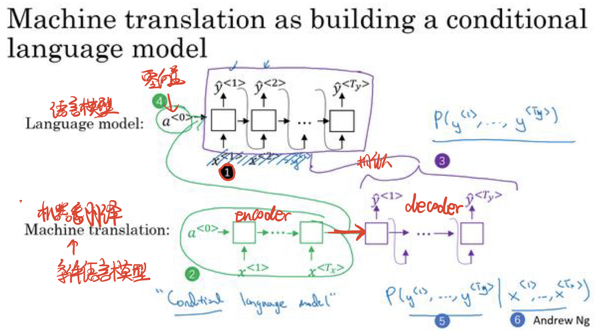
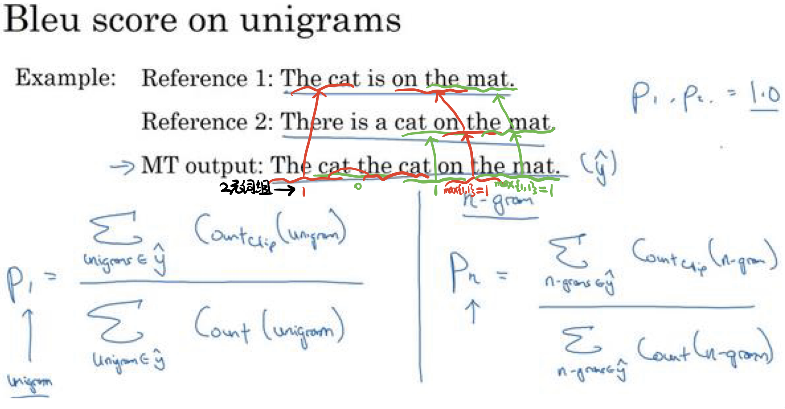

# 序列模型

## 1.Seq2Seq模型

**Seq2Seq模型,也可称为编码器—解码器**,是输出的长度不确定时采用的模型.Seq2Seq模型一般是在机器翻译和语音识别的任务中出现,比如将一句中文翻译成英文,那么输入输出语句的长度并不确定且很可能长度不相等.

> 这是最简单的Seq2Seq模型,是典型的多对一RNN结构,一个初始(零)向量加上依次输入的序列向量,每个序列向量的输出又和下一个序列向量一起作为输入向量.

**Seq2Seq模型本质上用到了两个循环神经网络,分别叫做编码器和解码器:**
**1.编码器**用来分析输⼊序列(把⼀个不定⻓的输⼊序列变换成⼀个定长的背景变量,并在该背景变量中编码输⼊序列信息.常用的编码器是循环神经网络).
**2.解码器**用来生成输出序列.

## 2.机器翻译

### 2.1 语言模型


> 机器翻译采用条件语言模型:
语言模型是有一个初始(零)向量的循环神经网络,而机器翻译所采用的则是条件语言模型,一个初始(零)向量加上依次输入的序列向量,最后输出一个结果向量,这个结果向量作为接下来生成输出序列的初始向量.
(Tips:图片描述也是采用相同思路,把图片压成一维向量,然后作为初始向量输入到RNN中)

### 2.2 束搜索

集束搜索常用于机器翻译领域,进行多对多的不等长输出.
机器翻译可分为两部分,第一部分是RNN,也就是编码器和解码器,第二部分是束搜索,负责输出结果.

> 假设词汇表大小是10000,集束宽是3,那么第一步从10000个结果中选择3个,之后每一步从10000*3=30000个结果中选择3个,直到句尾符号.(如果集束宽为1,则为贪婪算法)所以整个模型只需要三个网络.

### 2.3改进束搜索:归一化的对数似然目标函数


> 由于最终概率相乘很可能接近于0超出表示范围,所以采用对数求和的方式来表示,并且除以(单词数^α,alpha常取0.7),避免对数求和的绝对值过大

### 2.4 束搜索误差分析

设人类翻译结果的概率为Pa,机器输出的结果是Pb.那么如果Pa>Pb,则说明束搜索存在问题,没选出最好结果;如果Pa<Pb,则说明RNN存在问题,因为正常情况下人类翻译的质量更高,概率理应更高.

### 2.5 BLEU得分

通过BLEU得分来判断与人类翻译的相似性,进而判断不同机翻结果的好坏.
**得分规则:**
首先针对每条句子需要准备一定量的人类翻译用作参考.

> 假设机翻结果有n个词,则从i∈1~n统计n次i元词组的得分,对于每一个i元词组,统计所有i元词组参考中出现的次数(取出现次数最多的一组参考)记作k,i元词组的得分即为k/n.最终得分即从1~n与上年词组累加.

**惩罚因子:**我们往往会在每个输出句子的概率前加上一个惩罚因子BP,用来避免模型对于短句子的优先级过高:


### 2.6 机器翻译质量

1.不加注意力机制:句子很短时,上下文单词不足,容易误判;句子很长时,模型记忆长句子(比如各种从句)很难,也容易出错.所以BLEU得分随着句中单词数的增多而呈现先增后降现象.
2.增加注意力机制:句子很短时依然容易误判,但是句子很长时可以只专注于一部分单词,翻译质量不会下降.所以BLEU得分随着句中单词数的增多而呈现先增后持平现象.

### 2.7 实践代码

**基本步骤:**
**1.数据预处理:** 把文本集中的数据进行清洗(分词,统计词频,填充长度等)
**2.注意力机制:** 根据公式计算输入数据的输出状态
**3.编码和解码:** 根据编码器和解码器的结构完成一层的计算(联合计算使用GRU,使用注意力机制计算背景向量C)
**4.训练和预测:** 定义损失函数,同时训练编码器和解码器的模型参数,即可预测

```python
# 机器翻译
import collections
import os
import io
import math
import torch
from torch import nn
import torch.nn.functional as F
import torchtext.vocab as Vocab
import torch.utils.data as Data
import sys

# <pad>(padding)符号是填充符,用来添加在较短序列后，使每个序列等长，
# <bos>和<eos>符号分别表示序列的开始和结束
PAD, BOS, EOS = '<pad>', '<bos>', '<eos>' # 标识符
os.environ["CUDA_VISIBLE_DEVICES"] = "0"
device = torch.device('cuda' if torch.cuda.is_available() else 'cpu')

# 数据预处理
# 将一个序列中所有的词记录在all_tokens中以便之后构造词典,然后在该序列后面添加填充PAD直到
# 序列长度变为max_seq_len,然后将序列保存在all_seqs中
def process_one_seq(seq_tokens, all_tokens, all_seqs, max_seq_len):
    # 只处理一个句子里的多个单词
    all_tokens.extend(seq_tokens) # 所有词汇(不去重)
    seq_tokens += [EOS] + [PAD] * (max_seq_len - len(seq_tokens) - 1)
    all_seqs.append(seq_tokens)

# 使用所有的词来构造词典(记录每个句子内每个单词的位置序号)。并将所有序列中的词变换为词索引后构造Tensor
def build_data(all_tokens, all_seqs):
    vocab = Vocab.Vocab(collections.Counter(all_tokens), specials=[PAD, BOS, EOS]) # 计数并降序排序
    indices = [[vocab.stoi[w] for w in seq] for seq in all_seqs] # 记录每个句子内每个单词的位置序号
    return vocab, torch.tensor(indices)
"""
TEXT.vocab.Vocab有三个属性:
freqs 用来返回每一个单词和其对应的频数
itos 按照下标的顺序返回每一个单词
stoi 返回每一个单词与其对应的下标
"""

# 为了演示方便，我们在这里使用一个很小的法语—英语数据集。
# 在这个数据集里，每一行是一对法语句子和它对应的英语句子，中间使用'\t'隔开。
# 在读取数据时，我们在句末附上“<eos>”符号，并可能通过添加“<pad>”符号使每个序列的长度均为max_seq_len。
# 我们为法语词和英语词分别创建词典。法语词的索引和英语词的索引相互独立。
def read_data(max_seq_len):
    # in和out分别是input和output的缩写
    in_tokens, out_tokens, in_seqs, out_seqs = [], [], [], []
    with io.open('./data/fr-en-small.txt') as f:
        lines = f.readlines()
    for line in lines:
        # in_seq是一个法语句子,out_seq是一个英语句子
        in_seq, out_seq = line.rstrip().split('\t') 
        # in_seq_tokens是一个法语句子的词汇,out_seq_tokens是一个英语句子的词汇
        in_seq_tokens, out_seq_tokens = in_seq.split(' '), out_seq.split(' ')
        if max(len(in_seq_tokens), len(out_seq_tokens)) > max_seq_len - 1:
            continue  # 如果加上EOS后长于max_seq_len，则忽略掉此样本
        process_one_seq(in_seq_tokens, in_tokens, in_seqs, max_seq_len) # 填充至最大长度
        process_one_seq(out_seq_tokens, out_tokens, out_seqs, max_seq_len)
    in_vocab, in_data = build_data(in_tokens, in_seqs)
    out_vocab, out_data = build_data(out_tokens, out_seqs)
    return in_vocab, out_vocab, Data.TensorDataset(in_data, out_data)
# 将序列的最大长度设成7，然后查看读取到的第一个样本。该样本分别包含法语词索引序列和英语词索引序列。
max_seq_len = 7
in_vocab, out_vocab, dataset = read_data(max_seq_len)
# print(in_vocab.stoi,out_vocab.stoi,dataset[0])

# 在编码器中，我们将输入语言的词索引通过词嵌入层得到词的表征，然后输入到一个多层门控循环单元中。
# PyTorch的nn.GRU实例在前向计算后也会分别返回输出和最终时间步的多层隐藏状态。
# 其中的输出指的是最后一层的隐藏层在各个时间步的隐藏状态，并不涉及输出层计算。注意力机制将这些输出作为键项和值项a。
class Encoder(nn.Module):
    def __init__(self, vocab_size, embed_size, num_hiddens, num_layers, drop_prob=0, **kwargs):
        super(Encoder, self).__init__(**kwargs)
        self.embedding = nn.Embedding(vocab_size, embed_size)
        self.rnn = nn.GRU(embed_size, num_hiddens, num_layers, dropout=drop_prob) # dropout丢弃层,防过拟合
    def forward(self, inputs, state): #前向计算
        # 输入形状是(批量大小, 激活状态)。将输出互换样本维和时间步维
        embedding = self.embedding(inputs.long()).permute(1, 0, 2) # (seq_len, batch, input_size)
        return self.rnn(embedding, state) # a
    def begin_state(self):
        return None # 隐藏态初始化为None时PyTorch会自动初始化为0

# 创建一个批量大小为4、激活状态为7的小批量序列输入。设门控循环单元的隐藏层个数为2，隐藏单元个数为16。
# 编码器对该输入执行前向计算后返回的输出形状为(激活状态, 批量大小, 隐藏单元个数)。
# 门控循环单元GRU在最终时间步的多层隐藏状态的形状为(隐藏层个数, 批量大小, 隐藏单元个数)。
# 对于门控循环单元来说，state就是一个元素，即隐藏状态；
# 如果使用长短期记忆，state是一个元组，包含两个元素即隐藏状态和记忆细胞。
encoder = Encoder(vocab_size=10, embed_size=8, num_hiddens=16, num_layers=2)
output, state = encoder(torch.zeros((4, 7)), encoder.begin_state())
# print(output.shape, state.shape) # GRU的state是h, 而LSTM的是一个元组(h, c)

# 将输入连结后通过含单隐藏层的多层感知机变换
# 其中隐藏层的输入是解码器的隐藏状态与编码器在所有时间步上隐藏状态的一一连结，且使用tanh函数作为激活函数
# 输出层的输出个数为1。两个Linear实例均不使用偏差。其中函数定义里向量的长度v是一个超参数，即attention_size
def attention_model(input_size, attention_size):
    model = nn.Sequential(nn.Linear(input_size, attention_size, bias=False), # nn.linear()是用来设置网络中的全连接层的
                          nn.Tanh(),
                          nn.Linear(attention_size, 1, bias=False))
    return model

# 注意力机制的输入包括查询项、键项和值项。设编码器和解码器的隐藏单元个数相同。
# 查询项为解码器的隐藏状态S，键项和值项均为编码器的隐藏状态a
# 这里的查询项为解码器在上一时间步的隐藏状态S，形状为(批量大小, 隐藏单元个数)；
# 键项和值项均为编码器在所有时间步的隐藏状态a，形状为(时间步数, 批量大小, 隐藏单元个数)。
# 注意力机制返回当前时间步的背景变量C，形状为(批量大小, 隐藏单元个数)。
def attention_forward(model, enc_states, dec_state):
    """
    dec_state: (批量大小, 隐藏单元个数) # 查询项S
    enc_states: (时间步数, 批量大小, 隐藏单元个数) # 键项和值项a
    """
    # 将解码器隐藏状态广播到和编码器隐藏状态形状相同后进行连结
    dec_states = dec_state.unsqueeze(dim=0).expand_as(enc_states) # S ,expand_as将张量扩展为参数tensor的大小。
    enc_and_dec_states = torch.cat((enc_states, dec_states), dim=2) # a+S
    e = model(enc_and_dec_states) # 形状为(时间步数, 批量大小, 1)
    alpha = F.softmax(e, dim=0) # 在时间步维度做softmax运算 -> α<t,t'>
    return (alpha * enc_states).sum(dim=0) # 返回背景变量 -> C<1> = sum(α<1,t'> * a<t'>) 

# 编码器的时间步数为10，批量大小为4，编码器和解码器的隐藏单元个数均为8。
# 注意力机制返回一个小批量的背景向量，每个背景向量的长度等于编码器的隐藏单元个数。因此输出的形状为(4, 8)。
seq_len, batch_size, num_hiddens = 10, 4, 8
model = attention_model(2*num_hiddens, 10) 
dec_state = torch.zeros((batch_size, num_hiddens)) # S
enc_states = torch.zeros((seq_len, batch_size, num_hiddens)) # a
# print(attention_forward(model, enc_states, dec_state).shape) # torch.Size([4, 8])

# 将编码器在最终时间步的隐藏状态a作为解码器的初始隐藏状态(这要求编码器和解码器的RNN隐藏层个数和隐藏单元个数相同)
# 在解码器的前向计算中，我们先通过刚刚介绍的注意力机制计算得到当前时间步的背景向量C。
# 由于解码器的输入来自输出语言的词索引，我们将输入通过词嵌入层得到表征，然后和背景向量C在特征维连结。
# 我们将连结后的结果与上一时间步的隐藏状态通过门控循环单元GRU计算出当前时间步的输出与隐藏状态。
# 最后，我们将输出通过全连接层变换为有关各个输出词的预测，形状为(批量大小, 输出词典大小)。
class Decoder(nn.Module):
    def __init__(self, vocab_size, embed_size, num_hiddens, num_layers, attention_size, drop_prob=0):
        super(Decoder, self).__init__()
        self.embedding = nn.Embedding(vocab_size, embed_size)
        self.attention = attention_model(2*num_hiddens, attention_size)
        # GRU的输入包含attention输出的c和实际输入, 所以尺寸是 num_hiddens+embed_size
        self.rnn = nn.GRU(num_hiddens + embed_size, num_hiddens, num_layers, dropout=drop_prob)
        self.out = nn.Linear(num_hiddens, vocab_size) # 全连接层
    def forward(self, cur_input, state, enc_states):
        """
        cur_input shape: (batch, )
        state shape: (num_layers, batch, num_hiddens)
        """
        # 使用注意力机制计算背景向量
        c = attention_forward(self.attention, enc_states, state[-1])
        # 将嵌入后的输入和背景向量在特征维连结, (批量大小, num_hiddens+embed_size)
        input_and_c = torch.cat((self.embedding(cur_input), c), dim=1)
        # 为输入和背景向量的连结增加时间步维，时间步个数为13
        output, state = self.rnn(input_and_c.unsqueeze(0), state) # S+C=y
        # 移除时间步维，输出形状为(批量大小, 输出词典大小)
        output = self.out(output).squeeze(dim=0)
        return output, state # y, S
    def begin_state(self, enc_state):
        # 直接将编码器最终时间步的隐藏状态a作为解码器的初始隐藏状态
        return enc_state # a

# 训练模型
# 实现batch_loss函数计算一个小批量的损失.
# 解码器在某时间步的输入为样本输出序列在上一时间步的词.
# 此外,同word2vec的实现一样,我们在这里也使用掩码变量避免填充项对损失函数计算的影响。
def batch_loss(encoder, decoder, X, Y, loss):
    batch_size = X.shape[0]
    enc_state = encoder.begin_state() # S<0>=None
    enc_outputs, enc_state = encoder(X, enc_state) # α,a
    # 初始化解码器的隐藏状态
    dec_state = decoder.begin_state(enc_state) # a<0>=None
    # 解码器在最初时间步的输入是BOS
    dec_input = torch.tensor([out_vocab.stoi[BOS]] * batch_size)
    # 我们将使用掩码变量mask来忽略掉标签为填充项PAD的损失
    mask, num_not_pad_tokens = torch.ones(batch_size,), 0
    l = torch.tensor([0.0])
    for y in Y.permute(1,0): # Y shape: (batch, seq_len)
        dec_output, dec_state = decoder(dec_input, dec_state, enc_outputs) # y,S
        l = l + (mask * loss(dec_output, y)).sum() # 计算模型输出的dec_output和已知正确结果y的差值
        dec_input = y  # 使用强制教学,以正确的y作为输入
        num_not_pad_tokens += mask.sum().item()
        # EOS后面全是PAD. 下面一行保证一旦遇到EOS接下来的循环中mask就一直是0
        mask = mask * (y != out_vocab.stoi[EOS]).float()
    return l / num_not_pad_tokens

# 在训练函数中，我们需要同时迭代编码器和解码器的模型参数。
def train(encoder, decoder, dataset, lr, batch_size, num_epochs):
    enc_optimizer = torch.optim.Adam(encoder.parameters(), lr=lr) # α
    dec_optimizer = torch.optim.Adam(decoder.parameters(), lr=lr) # S
    loss = nn.CrossEntropyLoss(reduction='none')
    data_iter = Data.DataLoader(dataset, batch_size, shuffle=True)
    for epoch in range(num_epochs):
        l_sum = 0.0
        for X, Y in data_iter:
            enc_optimizer.zero_grad()
            dec_optimizer.zero_grad()
            l = batch_loss(encoder, decoder, X, Y, loss)
            l.backward()
            enc_optimizer.step()
            dec_optimizer.step()
            l_sum += l.item()
        if (epoch + 1) % 10 == 0:
            print("epoch %d, loss %.3f" % (epoch + 1, l_sum / len(data_iter)))

# 创建模型实例并设置超参数。然后，我们就可以训练模型了。
embed_size, num_hiddens, num_layers = 64, 64, 2
attention_size, drop_prob, lr, batch_size, num_epochs = 10, 0.5, 0.01, 2, 50
encoder = Encoder(len(in_vocab), embed_size, num_hiddens, num_layers, drop_prob)
decoder = Decoder(len(out_vocab), embed_size, num_hiddens, num_layers, attention_size, drop_prob)
train(encoder, decoder, dataset, lr, batch_size, num_epochs)

# 预测不定长的序列
# 此处使用贪婪搜索,即束搜索的宽度为1
def translate(encoder, decoder, input_seq, max_seq_len):
    in_tokens = input_seq.split(' ')
    in_tokens += [EOS] + [PAD] * (max_seq_len - len(in_tokens) - 1)
    enc_input = torch.tensor([[in_vocab.stoi[tk] for tk in in_tokens]]) # batch=1
    enc_state = encoder.begin_state()
    enc_output, enc_state = encoder(enc_input, enc_state)
    dec_input = torch.tensor([out_vocab.stoi[BOS]])
    dec_state = decoder.begin_state(enc_state)
    output_tokens = []
    for _ in range(max_seq_len):
        dec_output, dec_state = decoder(dec_input, dec_state, enc_output)
        pred = dec_output.argmax(dim=1)
        pred_token = out_vocab.itos[int(pred.item())]
        if pred_token == EOS:  # 当任一时间步搜索出EOS时，输出序列即完成
            break
        else:
            output_tokens.append(pred_token)
            dec_input = pred
    return output_tokens
input_seq = 'ils regardent .'
print(translate(encoder, decoder, input_seq, max_seq_len)) # "they are watching."

# BLEU评价翻译结果
# 计算得分
def bleu(pred_tokens, label_tokens, k):
    len_pred, len_label = len(pred_tokens), len(label_tokens)
    score = math.exp(min(0, 1 - len_label / len_pred))
    for n in range(1, k + 1):
        num_matches, label_subs = 0, collections.defaultdict(int)
        for i in range(len_label - n + 1):
            label_subs[''.join(label_tokens[i: i + n])] += 1
        for i in range(len_pred - n + 1):
            if label_subs[''.join(pred_tokens[i: i + n])] > 0:
                num_matches += 1
                label_subs[''.join(pred_tokens[i: i + n])] -= 1
        score *= math.pow(num_matches / (len_pred - n + 1), math.pow(0.5, n))
    return score
# 打印分数
def score(input_seq, label_seq, k):
    pred_tokens = translate(encoder, decoder, input_seq, max_seq_len)
    label_tokens = label_seq.split(' ')
    print('bleu %.3f, predict: %s' % (bleu(pred_tokens, label_tokens, k), ' '.join(pred_tokens)))
# 预测正确则分数为1。
score('ils regardent .', 'they are watching .', k=2)
# 测试一个不在训练集中的样本。
score('ils sont canadienne .', 'they are canadian .', k=2)
```

## 3.注意力机制


> 第一个单词的输入是上下文C1,它由注意力权重α<1,1>~α<1,Tx>和各自的激活状态/输入a<t'>的乘积求和得到.然后隐藏状态S和上下文C作为输入生成结果y.
(Tips:S是指隐藏状态,除初始零向量外由上下文C确定.α<t,t'>是指y<t>(生成第t个词时)应在a<t'>(第t'个输入上)放多少注意力.其中α是指注意力权重,a是激活状态/输入)

**计算注意力权重:**

> 由上一个隐藏状态S<t-1>和激活状态/输入a<t'>求得e<t,t'>(具体生成函数必须通过训练才能得知),然后注意力权重α<t,t'>=Softmax(e<t,t'>)
由于S和a生成e的函数是未知的,所以我们也需要通过一个小的神经网络训练,得到相应注意力权重,才能进一步生成输出句子.

## 4.语音识别

### 4.1 训练方法

**1.音位:** 把语音分解成基本的声音单元(例如"quick"->"k"+"w"+"i"+"k")进行RNN训练
**2.端到端(end-to-end)系统:** 输入音频片段,直接转换成音频文本(可以借助注意力模型),不必使用音位.
**3.CTC损失函数:** 由于音频的秒数*赫兹数>>文本字数,所以CTC算是函数允许RNN生成ttt空白符用来补足长度,也用来分开各个单词.

### 4.2 应用

**触发字检测(关键词检测):** 计算出目标音频片段的声谱图特征,得到特征向量x1,x2...,然后放入RNN训练,可以在训练集中把目标音频之前的目标标签都设为0,这一段音频之后都设为1(为了防止0数>>1数,可以连续多次输出1进行增强)
