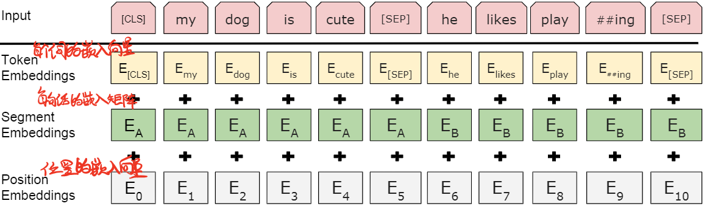
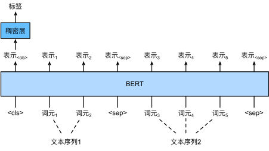
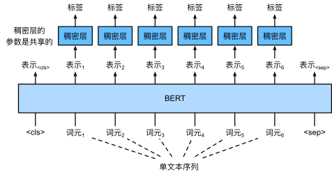
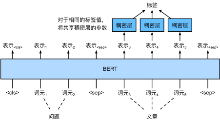

# BERT

## 1.BERT模型实现



> 按照图表构造3个bedding(Token,Segment,Position),加上transformer编码层组成Bert编码器, 然后输出编码语言模型(预测单词,完形填空)和句间关系判断, 即为BertModel
> 生成预训练模型: 读取数据集数据,转换成BERT输入格式,定义BERT模型实例,然后进行训练
> 测试样本数据: 读取样本数据,转换成BERT输入格式,放入网络模型中,即得到输出

**Tips:** 由于句间关系判断和预测单词属于基础性任务,因此用来训练模型可以作为其他子任务的基础.

网址: https://zh-v2.d2l.ai/chapter_natural-language-processing-applications/finetuning-bert.html

```python
import torch,os,random,time
from torch import nn
import d2l.torch as d2l

"""BERT模型============================================================================="""
# 返回tokens_a和tokens_b中所有词元的BERT（net）表示。
def get_tokens_and_segments(tokens_a, tokens_b=None):
    """获取输入序列的词元及其片段索引,变成BERT的输入"""
    tokens = ['<cls>'] + tokens_a + ['<sep>']
    # 0和1分别标记片段A和B
    segments = [0] * (len(tokens_a) + 2) 
    if tokens_b is not None:
        tokens += tokens_b + ['<sep>']
        segments += [1] * (len(tokens_b) + 1)
    return tokens, segments

# 与TransformerEncoder不同, BERTEncoder使用片段嵌入和可学习的位置嵌入。
class BERTEncoder(nn.Module):
    """BERT编码器"""
    """论文图表2"""
    def __init__(self, vocab_size, num_hiddens, norm_shape, ffn_num_input,
                 ffn_num_hiddens, num_heads, num_layers, dropout,
                 max_len=1000, key_size=768, query_size=768, value_size=768,
                 **kwargs):
        super(BERTEncoder, self).__init__(**kwargs)
        # num_hiddens即隐藏单元数,也可以说是词的维度
        self.token_embedding = nn.Embedding(vocab_size, num_hiddens)
        # BERT:片段嵌入:有两个取值:0/1(句子a/句子b)
        self.segment_embedding = nn.Embedding(2, num_hiddens)
        self.blks = nn.Sequential()
        for i in range(num_layers): # block个数
            # 每一个block都是transformer的编码器块
            # f"{i}"格式化字符串
            self.blks.add_module(f"{i}", d2l.EncoderBlock(
                key_size, query_size, value_size, num_hiddens, norm_shape,
                ffn_num_input, ffn_num_hiddens, num_heads, dropout, True))
        # 在BERT中，位置嵌入是可学习的，因此我们创建一个足够长的位置嵌入参数
        self.pos_embedding = nn.Parameter(torch.randn(1, max_len, num_hiddens))

    def forward(self, tokens, segments, valid_lens):
        # 按照论文图表2相加
        # 在以下代码段中，X的形状保持不变：（批量大小，最大序列长度，num_hiddens）
        X = self.token_embedding(tokens) + self.segment_embedding(segments)
        X = X + self.pos_embedding.data[:, :X.shape[1], :]
        for blk in self.blks:
            X = blk(X, valid_lens)
        return X

vocab_size, num_hiddens, ffn_num_hiddens, num_heads = 10000, 768, 1024, 4
norm_shape, ffn_num_input, num_layers, dropout = [768], 768, 2, 0.2
encoder = BERTEncoder(vocab_size, num_hiddens, norm_shape, ffn_num_input,
                      ffn_num_hiddens, num_heads, num_layers, dropout)

# 将tokens定义为长度为8的2个输入序列，其中每个词元是词表的索引。
# 使用输入tokens的BERTEncoder的前向推断返回编码结果，其中每个词元由向量表示，
# 其长度由超参数num_hiddens定义。此超参数通常称为Transformer编码器的隐藏层大小（隐藏单元数）。
tokens = torch.randint(0, vocab_size, (2, 8)) # 返回16个0~10000之间的值, batch_size=2,length=8
segments = torch.tensor([[0, 0, 0, 0, 1, 1, 1, 1], # 标记每个词的归属
                        [0, 0, 0, 1, 1, 1, 1, 1]])
encoded_X = encoder(tokens, segments, None)
# print("tokens:",tokens)
# print("segments:",segments)
# print("encoded_X:",encoded_X)
# print("encoded_X.shape:",encoded_X.shape) # torch.Size([2, 8, 768]) # [句子数,句长,隐藏单元数] 

"""
BERTEncoder的前向推断给出了输入文本的每个词元和插入的特殊标记“<cls>”及“<seq>”的BERT表示。
接下来，我们将使用这些表示来计算预训练BERT的损失函数。
预训练包括以下两个任务：掩蔽语言模型和下一句预测。
"""

# 掩蔽语言模型
# MaskLM类来预测BERT预训练的掩蔽语言模型任务中的掩蔽标记。预测使用单隐藏层的多层感知机(self.mlp)
class MaskLM(nn.Module):
    """BERT的掩蔽语言模型任务"""
    def __init__(self, vocab_size, num_hiddens, num_inputs=768, **kwargs):
        super(MaskLM, self).__init__(**kwargs)
        self.mlp = nn.Sequential(nn.Linear(num_inputs, num_hiddens),
                                 nn.ReLU(),
                                 nn.LayerNorm(num_hiddens),
                                 nn.Linear(num_hiddens, vocab_size)) # 全连接
    # 在前向推断中,它需要两个输入:BERTEncoder的编码结果和用于预测的词元位置。输出是这些位置的预测结果。
    # 把mask的单词(即pred_token)单独从特征中提取出来
    def forward(self, X, pred_positions): # X为BERTEncoder的编码结果encoded_X, pred_positions是需要预测的mask单词
        num_pred_positions = pred_positions.shape[1]
        pred_positions = pred_positions.reshape(-1) # reshape(-1)则为一维化,若reshape(-1,2)则保留一个维度为二元组,然后剩下维度一维化
        batch_size = X.shape[0]
        batch_idx = torch.arange(0, batch_size)
        # 假设batch_size = 2, num_pred_positions = 3
        # 那么batch_idx是np.array（[0,0,0,1,1]）
        batch_idx = torch.repeat_interleave(batch_idx, num_pred_positions) # 输入张量按照指定维度进行扩展
        masked_X = X[batch_idx, pred_positions] # 把mask的单词(即pred_token)单独从特征中提取出来
        masked_X = masked_X.reshape((batch_size, num_pred_positions, -1))
        mlm_Y_hat = self.mlp(masked_X) # 预测并输出
        # mlm的前向推断返回encoded_X的所有掩蔽位置mlm_positions处的预测结果mlm_Y_hat。
        # 对于每个预测，结果的大小等于词表的大小10000。
        return mlm_Y_hat 

mlm = MaskLM(vocab_size, num_hiddens)
mlm_positions = torch.tensor([[1, 5, 2], [6, 1, 5]]) # 输入mask单词位置
mlm_Y_hat = mlm(encoded_X, mlm_positions)
# print("mlm_Y_hat:",mlm_Y_hat)
# print("mlm_Y_hat.shape:",mlm_Y_hat.shape) # [2,3,10000] # [句子数,每句预测的mask单词位置,词典大小]

# 通过掩码下的预测词元mlm_Y的真实标签mlm_Y_hat，我们可以计算在BERT预训练中的遮蔽语言模型任务的交叉熵损失。
mlm_Y = torch.tensor([[7, 8, 9], [10, 20, 30]])
loss = nn.CrossEntropyLoss(reduction='none')
mlm_l = loss(mlm_Y_hat.reshape((-1, vocab_size)), mlm_Y.reshape(-1)) # shape分别为[6,10000]和[6,1]
# print("="*60)
# print("mlm_l:",mlm_l)
# print("mlm_l:",mlm_l.shape)

# 判断是否是下一个句子
class NextSentencePred(nn.Module):
    """BERT的下一句预测任务"""
    def __init__(self, num_inputs, **kwargs):
        super(NextSentencePred, self).__init__(**kwargs)
        self.output = nn.Linear(num_inputs, 2) # 简单的2分类

    def forward(self, X):
        # X的形状：(batchsize,num_hiddens)
        return self.output(X)

encoded_X = torch.flatten(encoded_X, start_dim=1)
# NSP的输入形状:(batchsize，num_hiddens)
nsp = NextSentencePred(encoded_X.shape[-1])
nsp_Y_hat = nsp(encoded_X)
# print("="*60)
# print("nsp_Y_hat:",nsp_Y_hat)
# print("nsp_Y_hat.shape:",nsp_Y_hat.shape)

nsp_y = torch.tensor([0, 1])
nsp_l = loss(nsp_Y_hat, nsp_y)
# print("nsp_l:",nsp_l)
# print("nsp_l.shape:",nsp_l.shape)

class BERTModel(nn.Module):
    """BERT模型"""
    def __init__(self, vocab_size, num_hiddens, norm_shape, ffn_num_input,
                 ffn_num_hiddens, num_heads, num_layers, dropout,
                 max_len=1000, key_size=768, query_size=768, value_size=768,
                 hid_in_features=768, mlm_in_features=768,
                 nsp_in_features=768):
        super(BERTModel, self).__init__()
        self.encoder = BERTEncoder(vocab_size, num_hiddens, norm_shape,
                    ffn_num_input, ffn_num_hiddens, num_heads, num_layers,
                    dropout, max_len=max_len, key_size=key_size,
                    query_size=query_size, value_size=value_size)
        self.hidden = nn.Sequential(nn.Linear(hid_in_features, num_hiddens),nn.Tanh())
        self.mlm = MaskLM(vocab_size, num_hiddens, mlm_in_features)
        self.nsp = NextSentencePred(nsp_in_features)

    def forward(self, tokens, segments, valid_lens=None, pred_positions=None):
        encoded_X = self.encoder(tokens, segments, valid_lens)
        if pred_positions is not None:
            mlm_Y_hat = self.mlm(encoded_X, pred_positions)
        else:
            mlm_Y_hat = None
        # 用于下一句预测的多层感知机分类器的隐藏层，0是“<cls>”标记的索引
        # 0把句子对的第一个token提取出来做二分类
        nsp_Y_hat = self.nsp(self.hidden(encoded_X[:, 0, :]))
        return encoded_X, mlm_Y_hat, nsp_Y_hat


"""
***************************************************************************************************************
***************************************************************************************************************
***************************************************************************************************************
"""

"""生成预训练模型============================================================================="""

"""生成掩码语言模型MLM的数据============================================================================="""
# 从BERT输入序列生成遮蔽语言模型的训练样本
def _replace_mlm_tokens(tokens, candidate_pred_positions, num_mlm_preds, vocab):
    # 为遮蔽语言模型的输入创建新的词元副本，其中输入可能包含替换的“<mask>”或随机词元
    mlm_input_tokens = [token for token in tokens]
    pred_positions_and_labels = []
    # 打乱后用于在遮蔽语言模型任务中获取15%的随机词元进行预测
    random.shuffle(candidate_pred_positions)
    for mlm_pred_position in candidate_pred_positions:
        if len(pred_positions_and_labels) >= num_mlm_preds:
            break
        masked_token = None
        # 80%的时间：将词替换为“<mask>”词元
        if random.random() < 0.8:
            masked_token = '<mask>'
        else:
            # 10%的时间：保持词不变
            if random.random() < 0.5:
                masked_token = tokens[mlm_pred_position]
            # 10%的时间：用随机词替换该词
            else:
                masked_token = random.choice(vocab.idx_to_token)
        mlm_input_tokens[mlm_pred_position] = masked_token # 替换
        pred_positions_and_labels.append((mlm_pred_position, tokens[mlm_pred_position]))
    return mlm_input_tokens, pred_positions_and_labels

# 生成遮蔽语言模型任务的数据
# 输入tokens,返回输入词元的索引和进行预测的词元索引以及这些预测的标签索引
def _get_mlm_data_from_tokens(tokens, vocab):
    candidate_pred_positions = []
    # tokens是一个字符串列表
    for i, token in enumerate(tokens):
        # 在遮蔽语言模型任务中不会预测特殊词元
        if token in ['<cls>', '<sep>']:
            continue
        candidate_pred_positions.append(i)
    # 遮蔽语言模型任务中预测15%的随机词元
    num_mlm_preds = max(1, round(len(tokens)*0.15))
    mlm_input_tokens, pred_positions_and_labels = _replace_mlm_tokens(tokens, 
        candidate_pred_positions, num_mlm_preds, vocab)
    pred_positions_and_labels = sorted(pred_positions_and_labels, key=lambda x: x[0])
    # print(pred_positions_and_labels)
    pred_positions = [v[0] for v in pred_positions_and_labels]
    mlm_pred_labels = [v[1] for v in pred_positions_and_labels]
    return vocab[mlm_input_tokens], pred_positions, vocab[mlm_pred_labels]
    # 返回替换后的词表,替换位置和单词序号


"""生成判断句子关联的数据============================================================================="""
# 生成二分类任务的训练样本
def _get_next_sentence(sentence, next_sentence, paragraphs):
    if random.random() < 0.5:
        is_next = True
    else:
        # paragraphs是三重列表的嵌套
        next_sentence = random.choice(random.choice(paragraphs))
        is_next = False
    return sentence, next_sentence, is_next

# 生成下一句预测任务的数据
def _get_nsp_data_from_paragraph(paragraph, paragraphs, vocab, max_len):
    nsp_data_from_paragraph = []
    for i in range(len(paragraph) - 1):
        tokens_a, tokens_b, is_next = _get_next_sentence(paragraph[i], 
                                        paragraph[i+1], paragraphs)
        # 考虑1个'<cls>'词元和2个'<sep>'词元
        if len(tokens_a) + len(tokens_b) + 3 > max_len:
            continue
        tokens, segments = get_tokens_and_segments(tokens_a, tokens_b)
        nsp_data_from_paragraph.append((tokens, segments, is_next))
    return nsp_data_from_paragraph


"""将文本转换为预训练数据集============================================================================="""
# 填充输入
def _pad_bert_inputs(examples, max_len, vocab): 
    # examples包含来自两个预训练任务的辅助函数
    # _get_nsp_data_from_paragraph和_get_mlm_data_from_tokens的输出
    max_num_mlm_preds = round(max_len * 0.15)
    all_token_ids, all_segments, valid_lens,  = [], [], []
    all_pred_positions, all_mlm_weights, all_mlm_labels = [], [], []
    nsp_labels = []
    for (token_ids, pred_positions, mlm_pred_label_ids, segments, is_next) in examples:
        all_token_ids.append(torch.tensor(token_ids + [vocab['<pad>']] * (
            max_len - len(token_ids)), dtype=torch.long)) # 填充到相同长度方便小批量运算
        all_segments.append(torch.tensor(segments + [0] * (
            max_len - len(segments)), dtype=torch.long)) # 填充到相同长度方便小批量运算
        # valid_lens不包括'<pad>'的计数
        valid_lens.append(torch.tensor(len(token_ids), dtype=torch.float32))
        all_pred_positions.append(torch.tensor(pred_positions + [0] * (
            max_num_mlm_preds - len(pred_positions)), dtype=torch.long))
        # 填充词元的预测将通过乘以0权重在损失中过滤掉
        all_mlm_weights.append(
            torch.tensor([1.0] * len(mlm_pred_label_ids) + [0.0] * (
                max_num_mlm_preds - len(pred_positions)),
                dtype=torch.float32))
        all_mlm_labels.append(torch.tensor(mlm_pred_label_ids + [0] * (
            max_num_mlm_preds - len(mlm_pred_label_ids)), dtype=torch.long))
        nsp_labels.append(torch.tensor(is_next, dtype=torch.long))
    return (all_token_ids, all_segments, valid_lens, all_pred_positions,
            all_mlm_weights, all_mlm_labels, nsp_labels)

# 预训练BERT的WikiText-2数据集
class _WikiTextDataset(torch.utils.data.Dataset):
    def __init__(self, paragraphs, max_len):
        # 输入paragraphs[i]是代表段落的句子字符串列表；
        # 而输出paragraphs[i]是代表段落的句子列表，其中每个句子都是词元列表
        # tokenize把词按照空格分开
        paragraphs = [d2l.tokenize(paragraph, token='word') for paragraph in paragraphs]
        sentences = [sentence for paragraph in paragraphs for sentence in paragraph]
        self.vocab = d2l.Vocab(sentences, min_freq=5, # 过滤掉词频低于5的单词
                               reserved_tokens=['<pad>', '<mask>', '<cls>', '<sep>'])
        # 获取下一句子预测任务的数据
        examples = []
        for paragraph in paragraphs:
            examples.extend(_get_nsp_data_from_paragraph(
                paragraph, paragraphs, self.vocab, max_len))
        # 获取遮蔽语言模型任务的数据
        examples = [(_get_mlm_data_from_tokens(tokens, self.vocab) + (segments, is_next))
                     for tokens, segments, is_next in examples]
        # 填充输入
        (self.all_token_ids, self.all_segments, self.valid_lens,
         self.all_pred_positions, self.all_mlm_weights,self.all_mlm_labels,
         self.nsp_labels) = _pad_bert_inputs(examples,max_len, self.vocab)

    # 实现__getitem__函数,我们可以任意访问WikiText-2语料库的
    # 一对句子生成的预训练样本（遮蔽语言模型和下一句预测）样本。
    def __getitem__(self, idx):
        return (self.all_token_ids[idx], self.all_segments[idx],
                self.valid_lens[idx], self.all_pred_positions[idx],
                self.all_mlm_weights[idx], self.all_mlm_labels[idx],
                self.nsp_labels[idx])

    def __len__(self):
        return len(self.all_token_ids)


"""读取数据============================================================================="""
# WikiText-2数据集中，每行代表一个段落
def _read_wiki(data_dir):
    file_name = os.path.join(data_dir, 'wiki.train.tokens')
    with open(file_name, 'r',encoding='utf-8') as f:
        lines = f.readlines()
    # 大写字母转换为小写字母
    paragraphs = [line.strip().lower().split(' . ')
                  for line in lines if len(line.split(' . ')) >= 2]
    random.shuffle(paragraphs)
    return paragraphs # 二维列表[段落,句子]

# 下载并生成WikiText-2数据集，并从中生成预训练样本 
def load_data_wiki(batch_size, max_len):
    """加载WikiText-2数据集"""
    data_dir = './data/wikitext-2'
    paragraphs = _read_wiki(data_dir)
    # print(data_dir)
    train_set = _WikiTextDataset(paragraphs, max_len)
    train_iter = torch.utils.data.DataLoader(train_set, batch_size, shuffle=True, num_workers=0)
    # torch.utils.data.DataLoader:
    # 该接口主要用来将自定义的或者PyTorch已有的数据读取接口的输入按照batch size封装成Tensor
    return train_iter, train_set.vocab


"""预训练============================================================================="""
batch_size, max_len = 512, 64
train_iter, vocab = load_data_wiki(batch_size, max_len)

net = BERTModel(len(vocab), num_hiddens=128, norm_shape=[128],
                    ffn_num_input=128, ffn_num_hiddens=256, num_heads=2,
                    num_layers=2, dropout=0.2, key_size=128, query_size=128,
                    value_size=128, hid_in_features=128, mlm_in_features=128,
                    nsp_in_features=128)
devices = [torch.device('cpu')] # d2l.try_all_gpus()
loss = nn.CrossEntropyLoss()

# 在定义训练代码实现之前，我们定义了一个辅助函数_get_batch_loss_bert。
# 给定训练样本，该函数计算遮蔽语言模型和下一句子预测任务的损失。
# BERT预训练的最终损失是遮蔽语言模型损失和下一句预测损失的和。
def _get_batch_loss_bert(net, loss, vocab_size, tokens_X,
                         segments_X, valid_lens_x,
                         pred_positions_X, mlm_weights_X,
                         mlm_Y, nsp_y):
    # 前向传播
    # mlm_Y_hat.shape: [2,3,10000] # [句子数,每句预测的mask单词位置,词典大小]
    _, mlm_Y_hat, nsp_Y_hat = net(tokens_X, segments_X, valid_lens_x.reshape(-1), pred_positions_X)
    # 计算遮蔽语言模型损失
    mlm_l = loss(mlm_Y_hat.reshape(-1, vocab_size), mlm_Y.reshape(-1)) * mlm_weights_X.reshape(-1, 1)
    mlm_l = mlm_l.sum() / (mlm_weights_X.sum() + 1e-8)
    # 计算下一句子预测任务的损失
    nsp_l = loss(nsp_Y_hat, nsp_y)
    l = mlm_l + nsp_l
    return mlm_l, nsp_l, l

# 在WikiText-2（train_iter）数据集上预训练BERT（net）
def train_bert(train_iter, net, loss, vocab_size, devices, num_steps):
    net = nn.DataParallel(net, device_ids=devices).to(devices[0])
    trainer = torch.optim.Adam(net.parameters(), lr=0.01)
    step, timer = 0, d2l.Timer()
    # animator = d2l.Animator(xlabel='step', ylabel='loss', xlim=[1, num_steps], legend=['mlm', 'nsp'])
    # 遮蔽语言模型损失的和，下一句预测任务损失的和，句子对的数量，计数
    metric = d2l.Accumulator(4)
    num_steps_reached = False
    while step < num_steps and not num_steps_reached:
        for tokens_X, segments_X, valid_lens_x, pred_positions_X, mlm_weights_X, mlm_Y, nsp_y in train_iter:
            tokens_X = tokens_X.to(devices[0])
            segments_X = segments_X.to(devices[0])
            valid_lens_x = valid_lens_x.to(devices[0])
            pred_positions_X = pred_positions_X.to(devices[0])
            mlm_weights_X = mlm_weights_X.to(devices[0])
            mlm_Y, nsp_y = mlm_Y.to(devices[0]), nsp_y.to(devices[0])
            trainer.zero_grad()
            timer.start()
            mlm_l, nsp_l, l = _get_batch_loss_bert(net, loss, vocab_size, tokens_X, segments_X, 
                                    valid_lens_x, pred_positions_X, mlm_weights_X, mlm_Y, nsp_y)
            l.backward()
            trainer.step()
            metric.add(mlm_l, nsp_l, tokens_X.shape[0], 1)
            timer.stop()
            # animator.add(step+1, (metric[0] / metric[3], metric[1] / metric[3]))
            step += 1
            if step == num_steps:
                num_steps_reached = True
                break
    print(f'MLM loss {metric[0] / metric[3]:.3f},', f'NSP loss {metric[1] / metric[3]:.3f}')
    print(f'{metric[2] / timer.sum():.1f} sentence pairs/sec on 'f'{str(devices)}')

train_bert(train_iter, net, loss, len(vocab), devices, 3)


"""用BERT表示文本============================================================================="""
# 返回tokens_a和tokens_b中所有词元的BERT（net）表示
def get_bert_encoding(net, tokens_a, tokens_b=None):
    tokens, segments = get_tokens_and_segments(tokens_a, tokens_b)
    token_ids = torch.tensor(vocab[tokens], device=devices[0]).unsqueeze(0)
    segments = torch.tensor(segments, device=devices[0]).unsqueeze(0)
    valid_len = torch.tensor(len(tokens), device=devices[0]).unsqueeze(0)
    encoded_X, _, _ = net(token_ids, segments, valid_len)
    return encoded_X

tokens_a = ['a', 'crane', 'is', 'flying']
# encoded_text[:, 0, :]是整个输入语句的BERT表示
encoded_text = get_bert_encoding(net, tokens_a)
# 词元：'<cls>','a','crane','is','flying','<sep>'
encoded_text_cls = encoded_text[:, 0, :]
encoded_text_crane = encoded_text[:, 2, :]
print(encoded_text.shape, encoded_text_cls.shape, 
      encoded_text_crane.shape, encoded_text_crane[0][:3])

tokens_a, tokens_b = ['a', 'crane', 'driver', 'came'], ['he', 'just', 'left']
# encoded_pair[:, 0, :]是来自预训练BERT的整个句子对的编码结果
encoded_pair = get_bert_encoding(net, tokens_a, tokens_b)
# 词元：'<cls>','a','crane','driver','came','<sep>','he','just', 'left','<sep>'
encoded_pair_cls = encoded_pair[:, 0, :]
# 多义词元“crane”的前三个元素与上下文不同时的值不同。这支持了BERT表示是上下文敏感的
encoded_pair_crane = encoded_pair[:, 2, :]
print(encoded_pair.shape, encoded_pair_cls.shape, 
      encoded_pair_crane.shape, encoded_pair_crane[0][:3])
# torch.Size([1, 6, 128]) torch.Size([1, 128]) torch.Size([1, 128])
```

> **Tips:** 有cuda的话可能需要修改d2l.torch(我把名字改为了d2l.pytorch,避免重名)中的sequence_mask函数,在使用valid_len之前加一句`valid_len = valid_len.float() # cjk: 原来没有这一句`

## 2.针对序列级和词元级应用程序微调BERT

* 对于序列级和词元级自然语言处理应用，BERT只需要最小的架构改变（额外的全连接层），如单个文本分类（例如，情感分析和测试语言可接受性）、文本对分类或回归（例如，自然语言推断和语义文本相似性）、文本标记（例如，词性标记）和问答。
* 在下游应用的监督学习期间，额外层的参数是从零开始学习的，而预训练BERT模型中的所有参数都是微调的。
* 微调即构造和下游任务有关的输入

### 2.1 单文本分类

单文本分类将单个文本序列作为输入，并输出其分类结果。 除了情感分析之外，语言可接受性语料库（Corpus of Linguistic Acceptability，COLA）也是一个单文本分类的数据集，它的要求判断给定的句子在语法上是否可以接受。 [Warstadt et al., 2019]。例如，“I should study.”是可以接受的，但是“I should studying.”不是可以接受的。


### 2.2文本对分类或回归

文本对分类是指以一对文本作为输入但输出连续值，代码实现的**自然语言推断**就属于文本对分类.除此之外,**语义文本相似度**也是一个流行的“文本对回归”任务,这项任务评估句子的语义相似度。例如，在语义文本相似度基准数据集（Semantic Textual Similarity Benchmark）中，句子对的相似度得分是从0（无语义重叠）到5（语义等价）的分数区间,我们的目标是预测这些分数。来自语义文本相似性基准数据集的样本包括（句子1，句子2，相似性得分）:

* "A plane is taking off.", "An air plane is taking off.", 5.000分;
* "A woman is eating something.", "A woman is eating meat.", 3.000分;
* "A woman is dancing.", "A man is talking.", 0.000分。
  

### 2.3 文本标注

文本标注（text tagging）属于词元级任务，其中每个词元都被分配了一个标签。在文本标注任务中，词性标注为每个单词分配词性标记（例如，形容词和限定词）。 根据单词在句子中的作用。如，在Penn树库II标注集中，句子“John Smith‘s car is new”应该被标记为“NNP（名词，专有单数）NNP POS（所有格结尾）NN（名词，单数或质量）VB（动词，基本形式）JJ（形容词）”。


### 2.4 问答

问答也属于词元级应用,它反映阅读理解能力。 例如，斯坦福问答数据集（Stanford Question Answering Dataset，SQuAD v1.1）由阅读段落和问题组成，其中每个问题的答案只是段落中的一段文本（文本片段）。
比如,考虑一段话：“Some experts report that a mask’s efficacy is inconclusive.However,mask makers insist that their products,such as N95 respirator masks,can guard against the virus.”（“一些专家报告说面罩的功效是不确定的。然而，口罩制造商坚持他们的产品，如N95口罩，可以预防病毒。”）还有一个问题“Who say that N95 respirator masks can guard against the virus?”（“谁说N95口罩可以预防病毒？”）。答案应该是文章中的文本片段“mask makers”（“口罩制造商”）。因此，SQuAD v1.1的目标是在给定问题和段落的情况下预测段落中文本片段的开始和结束。


## 3.预训练-微调

**详见DL基础->4.迁移学习**
BERT-微调.py没有改变BERT模型本身,只是加了个输出层(微调训练只是改变输出层之前的网络),然后把数据集的输入(不同的数据集标签不同,训练后的效果也就不同)调整为BERT模式,所以直接修改原模型

BERT-微调.py通过json文件获取词汇数据,然后加载模型参数(虽然后缀为参数文件为"XXX.params",但和pt文件操作一样),因为没加载完整模型,所以加载和保存也只能用第一种方法

## 4.自然语言推断：微调BERT

**代码流程:** 加载预训练的BERT模型,然后微调(调整SNLI数据转换成BERT输入模式,然后在BERT输出之上再加一个MLP),输出三种推断结果

```python
import json
import multiprocessing
import os
import torch
from torch import nn
from d2l import torch as d2l


"""
***************************************************************************
SNLI数据集的下游任务自然语言推断
***************************************************************************
"""


"""加载预训练的BERT模型============================================================================="""
# 加载预先训练好的BERT参数
# 预训练好的BERT模型包含一个定义词表的vocab.json文件和一个预训练参数的pretrained.params文件
def load_pretrained_model(pretrained_model, num_hiddens, ffn_num_hiddens,
                          num_heads, num_layers, dropout, max_len, devices):
    data_dir = f'./data/{pretrained_model}.torch'
    # 定义空词表以加载预定义词表
    vocab = d2l.Vocab()
    vocab.idx_to_token = json.load(open(os.path.join(data_dir, 'vocab.json')))
    vocab.token_to_idx = {token: idx for idx, token in enumerate(vocab.idx_to_token)}
    bert = d2l.BERTModel(len(vocab), num_hiddens, norm_shape=[256],
                         ffn_num_input=256, ffn_num_hiddens=ffn_num_hiddens,
                         num_heads=4, num_layers=2, dropout=0.2,
                         max_len=max_len, key_size=256, query_size=256,
                         value_size=256, hid_in_features=256,
                         mlm_in_features=256, nsp_in_features=256)
    # 加载预训练BERT参数
    bert.load_state_dict(torch.load(os.path.join(data_dir, 'pretrained.params')))
    return bert, vocab


"""提取SNLI数据转换成BERT输入模式============================================================================="""
# 在每个样本中,前提和假设形成一对文本序列,并被打包成一个BERT输入序列
class SNLIBERTDataset(torch.utils.data.Dataset): # 定制的数据集类
    def __init__(self, dataset, max_len, vocab=None):
        # premise:前提 hypothesis:假设
        all_premise_hypothesis_tokens = [[p_tokens, h_tokens] for p_tokens, h_tokens 
            in zip(*[d2l.tokenize([s.lower() for s in sentences]) 
                for sentences in dataset[:2]])] # 分词

        self.labels = torch.tensor(dataset[2]) # return XX, YY, labels
        self.vocab = vocab
        self.max_len = max_len
        (self.all_token_ids, self.all_segments, 
            self.valid_lens) = self._preprocess(all_premise_hypothesis_tokens)
        print('read ' + str(len(self.all_token_ids)) + ' examples')

    # 预处理
    def _preprocess(self, all_premise_hypothesis_tokens): 
        pool = multiprocessing.Pool(4)  # 使用4个进程并行生成
        out = pool.map(self._mp_worker, all_premise_hypothesis_tokens) # 并行加速,分词填充
        all_token_ids = [token_ids for token_ids, segments, valid_len in out]
        all_segments = [segments for token_ids, segments, valid_len in out]
        valid_lens = [valid_len for token_ids, segments, valid_len in out] # 
        return (torch.tensor(all_token_ids, dtype=torch.long),
                torch.tensor(all_segments, dtype=torch.long),
                torch.tensor(valid_lens))

    # 分词,分句,填充
    def _mp_worker(self, premise_hypothesis_tokens):
        p_tokens, h_tokens = premise_hypothesis_tokens
        self._truncate_pair_of_tokens(p_tokens, h_tokens) # 截断文本标记
        tokens, segments = d2l.get_tokens_and_segments(p_tokens, h_tokens) # 分词,分句
        token_ids = self.vocab[tokens] + [self.vocab['<pad>']] * (self.max_len - len(tokens))
        segments = segments + [0] * (self.max_len - len(segments))
        valid_len = len(tokens)
        return token_ids, segments, valid_len

    # 截断文本标记至max_len
    def _truncate_pair_of_tokens(self, p_tokens, h_tokens): 
        # 为BERT输入中的'<CLS>'、'<SEP>'和'<SEP>'词元保留位置
        while len(p_tokens) + len(h_tokens) > self.max_len - 3:
            if len(p_tokens) > len(h_tokens):
                p_tokens.pop()
            else:
                h_tokens.pop()

    def __getitem__(self, idx):
        return (self.all_token_ids[idx], self.all_segments[idx],self.valid_lens[idx]), self.labels[idx]

    def __len__(self):
        return len(self.all_token_ids)


"""在BERT输出之上再加一个MLP============================================================================="""
# 只需要一个额外的多层感知机，该多层感知机由两个全连接层组成(self.hidden和self.output),
# 这个多层感知机将特殊的"<cls>"词元的BERT表示进行了转换,
class BERTClassifier(nn.Module):
    def __init__(self, bert):
        super(BERTClassifier, self).__init__()
        self.encoder = bert.encoder
        self.hidden = bert.hidden
        self.output = nn.Linear(256, 3) # 自然语言推断的三个输出：蕴涵、矛盾和中性.
    def forward(self, inputs):
        tokens_X, segments_X, valid_lens_x = inputs
        encoded_X = self.encoder(tokens_X, segments_X, valid_lens_x)
        return self.output(self.hidden(encoded_X[:, 0, :]))

if __name__ == '__main__':
    devices = d2l.try_all_gpus()
    bert, vocab = load_pretrained_model('bert.small', num_hiddens=256, ffn_num_hiddens=512, 
                        num_heads=4, num_layers=2, dropout=0.1, max_len=512, devices=devices)

    # 通过实例化SNLIBERTDataset类来生成训练和测试样本。
    # 这些样本将在自然语言推断的训练和测试期间进行小批量读取。
    batch_size, max_len, num_workers = 512, 128, 0
    data_dir = './data/snli_1.0'
    # 读取snli_1.0_train.txt并预处理(切词等)
    train_set = SNLIBERTDataset(d2l.read_snli(data_dir, True), max_len, vocab)
    # 读取snli_1.0_test.txt并预处理(切词等)
    test_set = SNLIBERTDataset(d2l.read_snli(data_dir, False), max_len, vocab)

    train_iter = torch.utils.data.DataLoader(train_set, batch_size, shuffle=True, num_workers=num_workers)
    test_iter = torch.utils.data.DataLoader(test_set, batch_size, num_workers=num_workers)
    # 预训练的BERT模型bert被送到用于下游应用的BERTClassifier实例net中
    net = BERTClassifier(bert)
    lr, num_epochs = 1e-4, 1
    trainer = torch.optim.Adam(net.parameters(), lr=lr)
    loss = nn.CrossEntropyLoss(reduction='none')
    # 已经使用预训练模型,不用再训练?
    d2l.train_ch13(net, train_iter, test_iter, loss, trainer, num_epochs, devices)
    (all_token_ids1, all_segments1, valid_lens1), labels1 = test_set[1]
    (all_token_ids2, all_segments2, valid_lens2), labels2 = test_set[2]
    inputs = all_token_ids1[:30], torch.tensor([list(all_segments1[:30]),list(all_segments2[:30])]), None
    print(net(inputs))
```

> **Tips:** 有cuda的话可能需要修改d2l.torch(我把名字改为了d2l.pytorch,避免重名)中的sequence_mask函数,在使用valid_len之前加一句`valid_len = valid_len.float() # cjk: 原来没有这一句`

**Tips:** 本项目需要继续训练,预训练BERT模型不能直接用来推断,只是因为模型都为BERT格式,所以貌似可以算出结果,但是必须训练,让模型根据NLI的label修改句子编码的权重,才能推断出正确的结果.即: *在下游应用的监督学习期间，额外层的参数是从零开始学习的，而预训练BERT模型中的所有参数都是微调的。*
